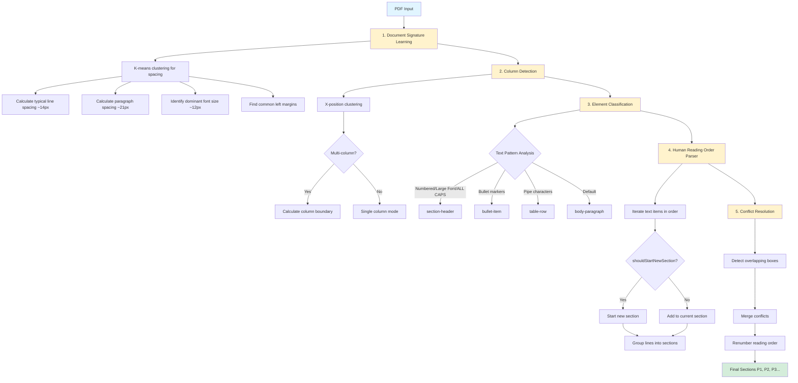
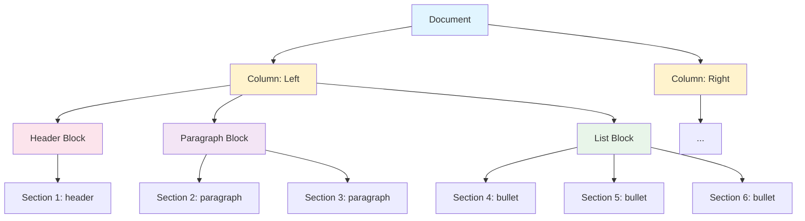
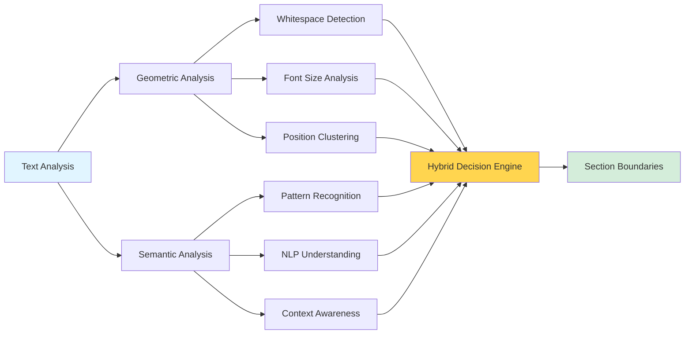

# PDF Document Redlining System - Current State PRD

**Date:** November 13, 2025
**Status:** Architecture failing to meet requirements
**Purpose:** Enable another AI to understand the problem space and propose better architectural solutions

---

## 1. Problem Statement

### Business Context
- **Users:** Billion-dollar lawyers reviewing legal contracts at 800+ words per second
- **Use Case:** Document redlining - striking out clauses, highlighting sections, referencing paragraphs in negotiations
- **Core Need:** Human-readable section references (P1, P2, P3...) that map to logical document elements

### Failure Mode
Current system misses 50-80% of document content OR over-segments into unusable single-line sections. Neither supports professional document review.

---

## 2. User Stories & Use Cases

### Primary User Persona
**Name:** Sarah Chen, Corporate Attorney
**Context:** Reviews 20-30 contracts per week, often during live negotiations
**Reading Speed:** 800+ words per second (trained speed reader)
**Key Pain Point:** Needs to reference specific clauses quickly and unambiguously during phone calls, video conferences, and written communications

### User Stories

#### US-1: Quick Reference During Phone Calls
**As a** contract attorney in a live negotiation call,
**I need to** quickly reference specific document sections using simple labels (P1, P2, P3),
**So that** I can say "Delete P7" or "Modify P12" and everyone on the call knows exactly what text I'm referring to without ambiguity.

**Acceptance Criteria:**
- Section labels appear immediately upon PDF upload (<2 seconds)
- Each label maps to exactly one logical text unit
- Labels are visible as overlays on the PDF
- No duplicate or overlapping section boundaries

**Workflow:**
1. Upload contract PDF before negotiation call
2. Scan document to identify key sections (5-10 seconds)
3. During call: "Looking at P7, the indemnification clause..."
4. Counterparty can instantly locate P7 on their copy
5. Discussion proceeds without delay or confusion

#### US-2: Multi-Section Selection for Redlining
**As a** legal reviewer preparing redline comments,
**I need to** select and mark multiple non-contiguous sections for deletion or modification,
**So that** I can efficiently communicate complex changes across the entire document.

**Acceptance Criteria:**
- Click any section to highlight it
- Shift+click to select range (P7-P12)
- Ctrl+click to add individual sections to selection
- Visual confirmation of all selected sections
- Export selection list to clipboard or file

**Workflow:**
1. Review contract and identify problematic clauses
2. Click P7 (limitation of liability clause)
3. Scroll to page 8, Shift+click P23 (selects P7-P23)
4. Ctrl+click P34 (adds to selection)
5. Export: "Delete: P7-P23, P34"

#### US-3: Section Navigation for Document Review
**As a** lawyer reviewing a 50-page agreement,
**I need to** jump between related sections quickly,
**So that** I can verify cross-references and understand clause relationships without losing my place.

**Acceptance Criteria:**
- Section list panel shows all sections with preview text
- Click section in list to jump to location in PDF
- Search sections by text content
- Bookmark frequently referenced sections
- Section hierarchy visible (headers vs body text)

**Workflow:**
1. Review "Termination" section (P45)
2. Notice reference to "Section 3.2"
3. Search section list for "3.2"
4. Jump to P12 to verify language
5. Click "Back" or use breadcrumb to return to P45

#### US-4: Bullet Point Redlining
**As a** contract reviewer,
**I need** each bullet point to be a separate, selectable section,
**So that** I can reference or redline individual bullets without affecting the entire list.

**Acceptance Criteria:**
- Each bullet item is a distinct section (P10, P11, P12...)
- Bullet continuation lines stay with their parent bullet
- Multi-line bullets remain as single section
- Can select individual bullets or entire list
- Nested bullets maintain hierarchy

**Workflow:**
1. Review scope of work with 12 bullet items
2. Identify bullet 7 as problematic
3. Click P17 (bullet 7)
4. Note: "Delete P17" in redline comments
5. Remaining bullets renumber automatically if needed

#### US-5: Table Cell Reference
**As a** pricing analyst reviewing financial terms,
**I need to** reference specific table cells or rows,
**So that** I can discuss pricing adjustments without ambiguity.

**Acceptance Criteria:**
- Tables detected as distinct sections
- Option to treat table as single section OR split by row
- Table cells maintain structure in section text
- Can copy table data with formatting preserved

**Workflow:**
1. Review pricing table on page 6
2. Table detected as P22 (entire table)
3. Click section settings to "Split table by rows"
4. Now P22 = header row, P23 = row 1, P24 = row 2...
5. Reference: "Reduce pricing in P24, column 3 by 15%"

#### US-6: Multi-Column Document Review
**As a** legal reviewer working with formatted proposals,
**I need** sections numbered in natural reading order (left column, then right),
**So that** P1-P20 flows logically and I don't accidentally reference the wrong section.

**Acceptance Criteria:**
- Multi-column layouts detected automatically
- Reading order follows: left column top→bottom, right column top→bottom
- No interleaving of columns
- Visual indicators show column boundaries
- Can override reading order if detection fails

#### US-7: Section Text Export for Analysis
**As a** contract manager,
**I need to** export all section text with labels to structured format (JSON, CSV),
**So that** I can analyze clauses programmatically or import into contract management systems.

**Acceptance Criteria:**
- Export button provides JSON, CSV, and plain text options
- JSON includes: section ID, reading order, type, text, coordinates
- CSV includes: section ID, type, text, page number
- Text format: "P1: [text]\nP2: [text]..."
- Export completes in <3 seconds for 100-page document

#### US-8: Manual Section Correction
**As a** user encountering incorrect section detection,
**I need to** manually split or merge sections,
**So that** I can correct the automated parsing without starting over.

**Acceptance Criteria:**
- Right-click section → "Split section"
- Select two sections → "Merge sections"
- Changes renumber subsequent sections
- Undo/redo functionality (10-step history)
- Visual feedback during editing
- Can save corrections for future uploads of same document

#### US-9: Section Type Classification
**As a** document reviewer,
**I need** sections visually coded by type (header, paragraph, bullet, table),
**So that** I can quickly scan document structure and identify key sections.

**Acceptance Criteria:**
- Color coding: Headers (blue), Paragraphs (green), Bullets (orange), Tables (red)
- Legend panel explains color scheme
- Filter view: "Show only headers"
- Section list groups by type
- Can override incorrect type classifications

#### US-10: Accessibility for Screen Readers
**As a** visually impaired attorney using screen reader software,
**I need** section labels and navigation to be keyboard accessible,
**So that** I can review and redline documents independently.

**Acceptance Criteria:**
- All section navigation via keyboard shortcuts
- Tab through sections in reading order
- ARIA labels on all interactive elements
- Screen reader announces: "Section P7, body paragraph, text: [content]"
- High contrast mode for visual users
- WCAG 2.1 AA compliance

### Use Case Scenarios

#### Scenario A: Live Contract Negotiation
**Context:** 3-way video call between buyer, seller, and their respective attorneys
**Duration:** 90 minutes
**Document:** 35-page Master Services Agreement

**Flow:**
1. **Pre-call (5 min):** All parties upload same PDF, system extracts 127 sections
2. **Opening (10 min):** Buyer's attorney: "Let's start with termination rights, P89-P94"
3. **Discussion (45 min):**
   - "P91 is problematic, we need 30 days notice, not 15"
   - "Agreed, modify P91 to extend notice period"
   - "What about P93? That seems to conflict with P12"
   - [Jump to P12] "Yes, we should delete P93 entirely"
4. **Documentation (30 min):** Scribe captures: "P91 (modify notice period), P93 (delete), P105 (add force majeure)"
5. **Post-call:** Export redline list, generate revision instructions

**Success Metrics:**
- Zero time wasted clarifying "which paragraph?"
- All parties locate references within 3 seconds
- Complete redline list captured accurately

#### Scenario B: Contract Review Workflow
**Context:** Junior associate reviewing vendor agreement for approval
**Duration:** 45 minutes
**Document:** 18-page vendor contract with exhibits

**Flow:**
1. **Upload & Scan (2 min):** PDF uploaded, 73 sections extracted, quick visual scan
2. **Clause Review (25 min):**
   - Review liability caps (P34-P37)
   - Check termination rights (P52-P56)
   - Verify data privacy terms (P61-P68)
   - Flag issue in P35: "Liability cap too low"
3. **Cross-Reference Check (10 min):**
   - P35 references "Section 8.3" → search → P61
   - Verify consistency between sections
4. **Redline Preparation (8 min):**
   - Select P34, P35, P36
   - Export selection
   - Add comments: "Increase liability cap to $5M, P35"
5. **Partner Review:** Email partner with PDF and redline list

---

## 3. Functional Requirements

### Must Have
1. **100% Text Coverage** - Every visible text must be in a section
2. **Human-Logical Groupings** - Sections match how humans read documents
3. **Functional References** - "Delete P7" must be unambiguous
4. **Reading Order** - P1→P2→P3... flows naturally top-to-bottom

### Document Elements to Detect
- **Section Headers** - "1. Title", "SECTION NAME", larger fonts, ALL CAPS
- **Body Paragraphs** - Normal text blocks separated by whitespace
- **Bullet Lists** - Items starting with •, ○, ■ (each bullet OR whole list as section)
- **Tables** - Structured data (group as single unit or by row)
- **Multi-Column Text** - Left column, then right column reading order
- **Sidebars/Callouts** - Visually distinct offset text

### Success Metrics
- **Coverage:** 100% of visible text extracted
- **Section Count:** Within ±20% of visual section count (human counted)
- **Usability:** Lawyer can reference "P7" and everyone knows what text

---

## 4. User Experience & Interaction Design

### User Journey Map

#### Phase 1: Upload & Extraction (0-5 seconds)
**User Actions:**
- Drag PDF file to upload zone OR click "Choose File" button
- File validation (size, format check)
- Upload progress indicator appears

**System Actions:**
- Accept PDF file (max 50MB)
- Display file name, page count, file size
- Begin PDF parsing with PDF.js
- Extract text content from all pages
- Run section detection algorithm
- Generate section boundaries and labels

**UX Requirements:**
- REQ-UX-1: Progress bar shows extraction status (0-100%)
- REQ-UX-2: Estimated time remaining displayed ("~15 seconds remaining")
- REQ-UX-3: Cancel button available during processing
- REQ-UX-4: Error messages are clear and actionable ("File too large. Maximum size: 50MB")

**Success State:**
- "Extraction complete: 127 sections found across 35 pages"
- PDF rendered with section overlay visible
- Section list panel populated

#### Phase 2: Review & Navigation (30-300 seconds)
**User Actions:**
- Scroll through PDF pages
- Hover over sections to see boundaries
- Click sections to select
- Use section list panel to jump to specific sections
- Search for text within sections
- Filter sections by type (headers, bullets, etc.)

**System Actions:**
- Highlight section boundaries on hover
- Display section metadata (ID, type, word count)
- Jump to section location when clicked from list
- Update viewport to center selected section
- Maintain scroll position history for back/forward navigation

**UX Requirements:**
- REQ-UX-5: Section boundaries visible as colored overlays (semi-transparent)
- REQ-UX-6: Hover reveals section details in tooltip: "P7 | body-paragraph | 47 words"
- REQ-UX-7: Selected section highlighted with thicker border + contrasting color
- REQ-UX-8: Section list panel docked to right side, resizable (min 250px, max 500px)
- REQ-UX-9: Smooth scroll animation when jumping to section (300ms ease-out)
- REQ-UX-10: Breadcrumb trail shows: "Page 3 > Section P7 > body-paragraph"

**Interaction Patterns:**
- Single click: Select section
- Double click: Open section editor (manual corrections)
- Right click: Context menu (split, merge, change type, copy text)
- Shift+click: Select range
- Ctrl/Cmd+click: Add to selection (multi-select)

#### Phase 3: Modification & Annotation (variable duration)
**User Actions:**
- Mark sections for deletion, modification, or addition
- Add comments/notes to specific sections
- Split incorrectly merged sections
- Merge over-segmented sections
- Override section type classification
- Reorder sections if reading order is wrong

**System Actions:**
- Track all user modifications
- Renumber sections automatically after splits/merges
- Maintain undo/redo history (10 steps)
- Auto-save modifications to local storage
- Validate modifications (no overlaps, no gaps in reading order)

**UX Requirements:**
- REQ-UX-11: Visual indicators for modified sections (yellow border)
- REQ-UX-12: Modification panel shows all changes: "P7 (deleted), P12-P14 (merged into P12)"
- REQ-UX-13: Undo/Redo buttons with keyboard shortcuts (Ctrl+Z, Ctrl+Shift+Z)
- REQ-UX-14: Confirmation dialog for destructive actions: "Merge 3 sections into P12?"
- REQ-UX-15: Real-time validation warnings: "Gap detected: P11 → P13 (missing P12)"

**Manual Editing Modes:**

**Split Section:**
1. Right-click section → "Split section"
2. System highlights text and shows: "Click between lines to create split point"
3. User clicks between two lines
4. System creates new section boundary
5. Sections renumber: P7 becomes P7 and P8, old P8 becomes P9, etc.

**Merge Sections:**
1. Select P12, P13, P14 (Ctrl+click each)
2. Right-click → "Merge selected sections"
3. Confirmation: "Merge 3 sections into P12? P13-P14 will be removed."
4. User confirms
5. System combines text, updates bounding box, renumbers subsequent sections

#### Phase 4: Export & Integration (5-15 seconds)
**User Actions:**
- Select export format (JSON, CSV, TXT, PDF annotations)
- Choose export scope (all sections, selected sections, or specific pages)
- Download or copy to clipboard
- Optionally save modifications for future use

**System Actions:**
- Generate export file in selected format
- Include metadata (section IDs, types, coordinates, text)
- Trigger browser download
- Store user modifications in localStorage (if requested)

**UX Requirements:**
- REQ-UX-16: Export dialog shows preview of output format
- REQ-UX-17: Export progress indicator for large documents (>100 pages)
- REQ-UX-18: Success message with download link: "Export complete: 127 sections (JSON, 45KB)"
- REQ-UX-19: Option to email export or copy shareable link (future integration)

### Visual Design Specifications

#### Section Overlay Color Coding
```css
/* Section type color scheme */
.section-header {
    border: 2px solid rgba(33, 150, 243, 0.7);  /* Blue */
    background: rgba(33, 150, 243, 0.1);
}

.section-paragraph {
    border: 2px solid rgba(76, 175, 80, 0.7);   /* Green */
    background: rgba(76, 175, 80, 0.05);
}

.section-bullet {
    border: 2px solid rgba(255, 152, 0, 0.7);   /* Orange */
    background: rgba(255, 152, 0, 0.1);
}

.section-table {
    border: 2px solid rgba(244, 67, 54, 0.7);   /* Red */
    background: rgba(244, 67, 54, 0.08);
}

/* Interaction states */
.section:hover {
    border-width: 3px;
    background-opacity: 0.15;
    cursor: pointer;
}

.section.selected {
    border: 3px solid #000;
    background: rgba(255, 235, 59, 0.2);  /* Yellow highlight */
    box-shadow: 0 0 10px rgba(0, 0, 0, 0.3);
}

.section.modified {
    border-style: dashed;
    border-color: rgba(255, 193, 7, 0.9);  /* Amber */
}
```

#### Section Label Positioning
- **Position:** Top-left corner of section bounding box
- **Offset:** -20px vertical (above box), 0px horizontal
- **Font:** Bold, 14px, sans-serif
- **Color:** Matches section type color (blue, green, orange, red)
- **Background:** White with 80% opacity + border matching section color
- **Padding:** 4px horizontal, 2px vertical
- **Example:** `<span class="section-label">P7</span>`

#### Section List Panel
```
┌─────────────────────────────────────┐
│ SECTIONS (127 total)          [X]   │  ← Header with close button
├─────────────────────────────────────┤
│ [Search sections...]          🔍    │  ← Search bar
│ ☐ Headers  ☐ Paragraphs            │  ← Filter checkboxes
│ ☐ Bullets  ☐ Tables                │
├─────────────────────────────────────┤
│ Page 1                              │  ← Page grouping
│  P1  📘 Legal Services Agreement    │  ← Section entry
│  P2  📗 This agreement is entered   │
│  P3  📙 • Scope of work includes... │
├─────────────────────────────────────┤
│ Page 2                              │
│  P4  📗 The contractor shall deli...│
│  P5  📗 Payment terms are Net 30... │
│  ...                                │
└─────────────────────────────────────┘
```

**Panel Features:**
- Fixed width: 350px (resizable 250-500px)
- Virtualized scrolling for 500+ sections
- Icons: 📘 (header), 📗 (paragraph), 📙 (bullet), 📕 (table)
- Text preview: First 30 characters + "..."
- Click section to jump and highlight in PDF viewer
- Current section highlighted in list when scrolling PDF

### Keyboard Navigation

| Shortcut | Action |
|----------|--------|
| `Tab` | Jump to next section |
| `Shift+Tab` | Jump to previous section |
| `Ctrl+F` | Search sections |
| `Ctrl+Z` | Undo last modification |
| `Ctrl+Shift+Z` | Redo last modification |
| `Ctrl+C` | Copy selected section text |
| `Ctrl+A` | Select all sections |
| `Escape` | Clear selection |
| `Home` | Jump to first section (P1) |
| `End` | Jump to last section |
| `PageUp` | Previous page |
| `PageDown` | Next page |
| `Arrow Up/Down` | Navigate sections in list |
| `Enter` | Jump to selected section in list |
| `Delete` | Mark selected sections for deletion |
| `Ctrl+Click` | Multi-select sections |
| `Shift+Click` | Range select sections |

### Tooltips & Contextual Help

**Section Hover Tooltip:**
```
┌─────────────────────────────┐
│ Section P7                  │
│ Type: body-paragraph        │
│ Words: 47                   │
│ Page: 3                     │
│ Column: left                │
│                             │
│ Click to select             │
│ Right-click for options     │
└─────────────────────────────┘
```

**Export Preview Tooltip:**
```
┌─────────────────────────────┐
│ JSON Export Preview:        │
│                             │
│ {                           │
│   "sections": [             │
│     {                       │
│       "id": "p7",           │
│       "order": 7,           │
│       "type": "body-para..  │
│       ...                   │
│                             │
│ [See full preview]          │
└─────────────────────────────┘
```

### Error States & Feedback

**Error Types:**
1. **Upload Errors:**
   - File too large: "File exceeds 50MB limit. Please compress or split PDF."
   - Invalid format: "File type not supported. Please upload a PDF file."
   - Corrupted PDF: "Unable to read PDF. File may be corrupted or password-protected."

2. **Extraction Errors:**
   - No text found: "PDF appears to be scanned images. OCR is not yet supported."
   - Partial extraction: "Warning: Only 45% of text extracted. Results may be incomplete."
   - Timeout: "Extraction taking longer than expected. Continue waiting or cancel?"

3. **Modification Errors:**
   - Invalid split: "Cannot split section: No valid split point selected."
   - Invalid merge: "Cannot merge non-adjacent sections. Select continuous range."
   - Overlap detected: "Warning: P12 and P13 overlap. Manual correction required."

**Visual Feedback:**
- Error messages: Red banner at top of screen, auto-dismiss after 8 seconds
- Warning messages: Yellow banner, manual dismiss required
- Success messages: Green banner, auto-dismiss after 3 seconds
- Loading states: Animated spinner + progress bar + status text

### Accessibility (WCAG 2.1 AA Compliance)

**Requirements:**
- **REQ-A11Y-1:** All interactive elements keyboard accessible (no mouse-only actions)
- **REQ-A11Y-2:** Color contrast ratio ≥ 4.5:1 for text, ≥ 3:1 for UI elements
- **REQ-A11Y-3:** ARIA labels on all buttons, controls, and interactive regions
- **REQ-A11Y-4:** Screen reader support for section navigation and metadata
- **REQ-A11Y-5:** Focus indicators visible on all interactive elements (2px solid border)
- **REQ-A11Y-6:** Text resize support up to 200% without loss of functionality
- **REQ-A11Y-7:** Alternative text for all visual indicators (color not sole differentiator)

**ARIA Implementation Example:**
```html
<div class="section"
     role="button"
     tabindex="0"
     aria-label="Section P7, body paragraph, 47 words"
     aria-describedby="section-type-paragraph"
     data-section-id="p7">
  <span class="section-label" aria-hidden="true">P7</span>
  <!-- Section content -->
</div>
```

**Screen Reader Announcements:**
- On section select: "Selected section P7, body paragraph. Press Enter to view details."
- On split: "Section P7 split into P7 and P8. 2 sections created."
- On merge: "Merged P12, P13, P14 into P12. 3 sections combined."
- On export: "Export complete. 127 sections downloaded as JSON file, 45 kilobytes."

### Responsive Design

**Desktop (1920x1080):**
- PDF viewer: 70% width (left side)
- Section list panel: 30% width (right side)
- Section labels: 18px font, full text
- Tooltips: Full detail mode

**Laptop (1366x768):**
- PDF viewer: 65% width
- Section list panel: 35% width, collapsible
- Section labels: 16px font
- Tooltips: Condensed mode

**Tablet (768x1024):**
- PDF viewer: Full width
- Section list panel: Overlay drawer (slides from right)
- Section labels: 14px font, abbreviated ("P7")
- Touch-friendly targets: Minimum 44x44px

**Mobile (375x667):**
- Not primary use case, but provide read-only view
- Section list: Bottom sheet
- Labels: Icon-only mode with tap-to-expand
- Export: Simplified options (text/JSON only)

### Performance Budgets

- **Initial Load:** <2 seconds for 20-page document
- **Section Extraction:** <100ms per page (target: <50ms)
- **Render Update:** <16ms (60 FPS) for smooth scrolling
- **Search:** <200ms for 500+ sections
- **Export:** <1 second for 100 sections
- **Memory:** <150MB for 100-page document
- **Section Hover Response:** <100ms (perceived as instant)

---

## 5. Integration Requirements

### External System Integrations

#### 5.1 Document Management Systems

**REQ-INT-1: SharePoint Integration**
- **Purpose:** Direct PDF upload from SharePoint libraries
- **Authentication:** OAuth 2.0 (Microsoft identity platform)
- **Operations:**
  - List documents in SharePoint library
  - Select and download PDF for processing
  - Upload annotated PDF back to SharePoint
  - Preserve document metadata and version history
- **Data Flow:** SharePoint → PDF Parser → Process → Export → SharePoint

**REQ-INT-2: Google Drive Integration**
- **Purpose:** Import PDFs from Google Drive
- **Authentication:** Google OAuth 2.0
- **Operations:**
  - Browse Drive folders via Google Picker API
  - Download selected PDF
  - Export results to Google Sheets (CSV conversion)
  - Save annotated PDF back to Drive
- **Rate Limits:** Respect Google Drive API quotas (1000 requests/100 seconds)

**REQ-INT-3: Dropbox Integration**
- **Purpose:** Cloud storage integration for legal teams
- **Authentication:** Dropbox OAuth 2.0
- **Operations:**
  - File picker integration
  - Direct download via Dropbox API
  - Save exports to specified Dropbox folder
- **File Size:** Support files up to 50MB

#### 5.2 Legal & Contract Tools

**REQ-INT-4: DocuSign Integration**
- **Purpose:** Export section references as DocuSign fields/tabs
- **Format:** Map sections to DocuSign anchor tags
- **Example:**
  ```json
  {
    "anchorString": "P7",
    "anchorUnits": "pixels",
    "anchorXOffset": "0",
    "anchorYOffset": "0",
    "tabLabel": "Section P7 - Modify"
  }
  ```
- **Use Case:** Automatically position signature fields based on section references

**REQ-INT-5: Microsoft Word Export**
- **Purpose:** Generate Word document with section annotations
- **Format:** DOCX with comments
- **Mapping:**
  - Section P7 → Word comment: "P7: body-paragraph"
  - Redline marks → Track Changes in Word
  - Section boundaries → Bookmarks
- **Library:** Use docx.js or similar for client-side generation

**REQ-INT-6: Contract Lifecycle Management (CLM) Systems**
- **Target Systems:** ContractWorks, Agiloft, Icertis
- **Integration Method:** RESTful API or CSV import
- **Data Export:**
  - Contract sections as structured data
  - Section metadata (type, page, coordinates)
  - Clause library integration (map sections to standard clauses)

#### 5.3 API Requirements

**REQ-INT-7: REST API Endpoints**

**Endpoint 1: Upload & Extract**
```http
POST /api/v1/documents/extract
Content-Type: multipart/form-data

Request Body:
- file: PDF file (binary)
- options: {
    "includeCoordinates": true,
    "detectTables": true,
    "splitBullets": true
  }

Response (200 OK):
{
  "documentId": "doc_abc123",
  "status": "completed",
  "pageCount": 35,
  "sectionCount": 127,
  "processingTime": "4.2s",
  "sections": [...]  // See JSON schema below
}
```

**Endpoint 2: Get Document Sections**
```http
GET /api/v1/documents/{documentId}/sections

Response (200 OK):
{
  "documentId": "doc_abc123",
  "sections": [
    {
      "id": "p7",
      "readingOrder": 7,
      "type": "body-paragraph",
      "text": "Please accept the following materials...",
      "boundingBox": {"x": 115, "y": 234, "width": 680, "height": 54},
      "page": 3,
      "wordCount": 47,
      "confidence": 0.85
    },
    ...
  ]
}
```

**Endpoint 3: Update Section (Manual Corrections)**
```http
PUT /api/v1/documents/{documentId}/sections/{sectionId}

Request Body:
{
  "type": "section-header",  // Override type
  "boundingBox": {...}       // Updated coordinates
}

Response (200 OK):
{
  "sectionId": "p7",
  "updated": true,
  "affectedSections": ["p7", "p8", "p9"]  // Renumbered sections
}
```

**Endpoint 4: Batch Processing**
```http
POST /api/v1/documents/batch

Request Body:
{
  "documents": [
    {"url": "https://example.com/contract1.pdf"},
    {"url": "https://example.com/contract2.pdf"}
  ],
  "options": {...}
}

Response (202 Accepted):
{
  "batchId": "batch_xyz789",
  "status": "processing",
  "totalDocuments": 2,
  "completedDocuments": 0,
  "estimatedCompletion": "2025-11-19T14:30:00Z"
}
```

**REQ-INT-8: Webhook Support**
- **Purpose:** Notify external systems when extraction completes
- **Configuration:** User provides webhook URL + secret for HMAC verification
- **Payload:**
  ```json
  {
    "event": "document.extraction.completed",
    "documentId": "doc_abc123",
    "timestamp": "2025-11-19T14:25:33Z",
    "data": {
      "sectionCount": 127,
      "pageCount": 35,
      "downloadUrl": "https://api.example.com/documents/doc_abc123/sections"
    }
  }
  ```
- **Retry Logic:** Exponential backoff (1s, 2s, 4s, 8s, 16s), max 5 attempts

#### 5.4 JSON Export Format Specification

**REQ-INT-9: Standardized JSON Schema**

```json
{
  "$schema": "https://json-schema.org/draft/2020-12/schema",
  "title": "PDF Section Extraction",
  "type": "object",
  "properties": {
    "metadata": {
      "type": "object",
      "properties": {
        "documentId": {"type": "string"},
        "fileName": {"type": "string"},
        "pageCount": {"type": "integer"},
        "sectionCount": {"type": "integer"},
        "extractionDate": {"type": "string", "format": "date-time"},
        "processingTime": {"type": "number", "description": "Seconds"},
        "parserVersion": {"type": "string"}
      },
      "required": ["documentId", "fileName", "pageCount", "sectionCount"]
    },
    "sections": {
      "type": "array",
      "items": {
        "type": "object",
        "properties": {
          "id": {"type": "string", "pattern": "^p[0-9]+$"},
          "readingOrder": {"type": "integer", "minimum": 1},
          "type": {
            "type": "string",
            "enum": ["section-header", "body-paragraph", "bullet-item", "table-row"]
          },
          "text": {"type": "string"},
          "boundingBox": {
            "type": "object",
            "properties": {
              "x": {"type": "number"},
              "y": {"type": "number"},
              "width": {"type": "number"},
              "height": {"type": "number"}
            },
            "required": ["x", "y", "width", "height"]
          },
          "page": {"type": "integer", "minimum": 1},
          "column": {"type": "string", "enum": ["single", "left", "right"]},
          "wordCount": {"type": "integer", "minimum": 0},
          "confidence": {"type": "number", "minimum": 0, "maximum": 1}
        },
        "required": ["id", "readingOrder", "type", "text", "boundingBox", "page"]
      }
    }
  },
  "required": ["metadata", "sections"]
}
```

**Example Export:**
```json
{
  "metadata": {
    "documentId": "doc_abc123",
    "fileName": "Master_Services_Agreement.pdf",
    "pageCount": 35,
    "sectionCount": 127,
    "extractionDate": "2025-11-19T14:25:33Z",
    "processingTime": 4.2,
    "parserVersion": "2.0.0"
  },
  "sections": [
    {
      "id": "p1",
      "readingOrder": 1,
      "type": "section-header",
      "text": "Legal Services Agreement",
      "boundingBox": {"x": 66, "y": 100, "width": 720, "height": 28},
      "page": 1,
      "column": "single",
      "wordCount": 3,
      "confidence": 0.95
    },
    {
      "id": "p2",
      "readingOrder": 2,
      "type": "body-paragraph",
      "text": "This agreement is entered into on November 19, 2025...",
      "boundingBox": {"x": 66, "y": 145, "width": 720, "height": 54},
      "page": 1,
      "column": "single",
      "wordCount": 47,
      "confidence": 0.88
    }
  ]
}
```

**REQ-INT-10: CSV Export Format**
```csv
Section ID,Reading Order,Type,Text,Page,Word Count,X,Y,Width,Height
p1,1,section-header,"Legal Services Agreement",1,3,66,100,720,28
p2,2,body-paragraph,"This agreement is entered into...",1,47,66,145,720,54
```

**REQ-INT-11: Plain Text Export**
```
DOCUMENT: Master_Services_Agreement.pdf
EXTRACTED: 2025-11-19 14:25:33
SECTIONS: 127

P1 [section-header, Page 1]:
Legal Services Agreement

P2 [body-paragraph, Page 1]:
This agreement is entered into on November 19, 2025...

P3 [bullet-item, Page 1]:
• Scope of work includes legal research and analysis
```

---

## 6. Non-Functional Requirements

### 6.1 Performance Requirements

**REQ-PERF-1: Extraction Latency**
- **p50 latency:** <500ms per page
- **p95 latency:** <1000ms per page
- **p99 latency:** <2000ms per page
- **Measurement:** From PDF.js text extraction complete to sections generated
- **Rationale:** Users expect near-instant results for typical 10-20 page contracts

**REQ-PERF-2: Rendering Performance**
- **Initial render:** <1 second for 20-page document
- **Section overlay render:** <16ms (60 FPS)
- **Scroll smoothness:** Maintain 60 FPS during fast scrolling
- **Memory usage:** <150MB for 100-page document in Chrome DevTools
- **DOM elements:** <5000 elements for section overlays (virtualize if needed)

**REQ-PERF-3: Search Performance**
- **Text search:** <200ms for 500 sections
- **Filter operations:** <100ms (filter by type, page, etc.)
- **Incremental search:** Update results as user types (<50ms per keystroke)

**REQ-PERF-4: Export Performance**
- **JSON export:** <1 second for 100 sections
- **CSV export:** <500ms for 100 sections
- **Text export:** <300ms for 100 sections
- **Streaming export:** Support for 1000+ section documents (chunked download)

**REQ-PERF-5: Browser Resource Usage**
- **CPU usage:** <25% during extraction (average across 4 cores)
- **CPU idle:** <5% when user viewing/scrolling
- **Network:** All processing client-side (no server calls during extraction)
- **localStorage:** <5MB per document for cached results

**REQ-PERF-6: Scalability Targets**
- **Document size:** Support up to 200 pages (realistic contract maximum)
- **Section count:** Up to 1000 sections per document
- **Concurrent documents:** 1 document at a time (browser tab limitation)
- **File size:** Up to 50MB PDF files

### 6.2 Reliability Requirements

**REQ-REL-1: Error Handling**
- **Graceful degradation:** If column detection fails, fall back to single-column mode
- **Partial results:** If extraction fails on page 17, return results for pages 1-16
- **Recovery:** User can retry failed operations without losing previous work
- **Error boundaries:** JavaScript errors in section rendering don't crash entire app

**REQ-REL-2: Data Integrity**
- **Coverage validation:** Warn if <95% of text items included in sections
- **Overlap detection:** Automatically detect and flag overlapping section boundaries
- **Reading order validation:** Ensure P1, P2, P3... sequence with no gaps
- **Type consistency:** Validate section types against predefined enum

**REQ-REL-3: State Management**
- **Auto-save:** Modifications saved to localStorage every 30 seconds
- **Crash recovery:** If browser crashes, restore state on reload
- **Undo/Redo:** Maintain 10-step history of user modifications
- **Session persistence:** Maintain state across page refreshes (for 24 hours)

**REQ-REL-4: Robustness to PDF Variations**
- **Font variations:** Handle PDFs with 10+ different fonts
- **Spacing variations:** Support line spacing from 8px to 28px
- **Malformed PDFs:** Handle missing fonts, corrupt text streams, embedded images
- **Password-protected:** Detect and inform user (not currently supported)
- **Scanned PDFs:** Detect image-only PDFs, inform user OCR needed

**REQ-REL-5: Browser Compatibility**
- **Chrome/Edge:** Version 90+ (Chromium-based)
- **Firefox:** Version 88+
- **Safari:** Version 14+
- **Mobile browsers:** iOS Safari 14+, Chrome Mobile 90+
- **Feature detection:** Polyfills for older browsers (PDF.js, Promise, async/await)

**REQ-REL-6: Availability**
- **Uptime:** 99.9% for hosted version (if deployed as web app)
- **Offline mode:** Local HTML file works without internet connection
- **CDN resilience:** Fallback to local PDF.js if CDN unavailable
- **No single point of failure:** All processing client-side (no server dependency)

### 6.3 Security & Privacy Requirements

**REQ-SEC-1: Data Privacy**
- **Client-side processing:** All PDF parsing in browser, no data sent to server
- **No data collection:** Do not track user documents, sections, or usage patterns
- **No logging:** Do not log PDF content or extracted sections
- **Clear data on exit:** Option to clear localStorage on tab close

**REQ-SEC-2: Secure File Handling**
- **File validation:** Verify PDF magic bytes (25 50 44 46 = "%PDF")
- **Size limits:** Reject files >50MB (prevent memory exhaustion attacks)
- **Type validation:** Only accept application/pdf MIME type
- **Sandbox execution:** PDF.js runs in isolated worker thread

**REQ-SEC-3: Content Security Policy (CSP)**
```http
Content-Security-Policy:
  default-src 'self';
  script-src 'self' https://cdnjs.cloudflare.com/ajax/libs/pdf.js/;
  style-src 'self' 'unsafe-inline';
  img-src 'self' data:;
  connect-src 'self';
  frame-ancestors 'none';
```

**REQ-SEC-4: GDPR Compliance**
- **No personal data processing:** System processes documents, not personal information
- **User consent:** If analytics added, require explicit opt-in
- **Data deletion:** User can clear all cached data via settings panel
- **Transparency:** Privacy policy clearly states client-side processing

**REQ-SEC-5: Dependency Security**
- **PDF.js version:** Use latest stable version (currently 3.11.174)
- **Subresource Integrity (SRI):** Verify CDN resources with SHA-384 hashes
- **Vulnerability scanning:** Monitor PDF.js CVE database for security issues
- **Update policy:** Update PDF.js within 30 days of security patch release

### 6.4 Usability Requirements

**REQ-USE-1: Learnability**
- **First-time user:** Can upload PDF and view sections within 60 seconds
- **Onboarding:** Optional 3-step tutorial on first use
- **Tooltips:** Context-sensitive help on all major features
- **Documentation:** Embedded help panel with FAQs and examples

**REQ-USE-2: Efficiency**
- **Expert users:** Can review 50-page document in <5 minutes
- **Keyboard shortcuts:** All major actions accessible via keyboard
- **Batch operations:** Select multiple sections for bulk actions
- **Search shortcuts:** Ctrl+F jumps directly to search, Enter to jump to result

**REQ-USE-3: Error Prevention**
- **Confirmation dialogs:** For destructive actions (delete, merge, clear all)
- **Undo always available:** Ctrl+Z works for last 10 actions
- **Auto-save:** Prevent data loss from accidental tab close
- **Visual warnings:** Highlight potential issues (overlaps, gaps, low confidence)

**REQ-USE-4: Feedback & Affordances**
- **Loading states:** Progress indicators for all async operations
- **Success messages:** Confirm completion ("127 sections extracted")
- **Error messages:** Specific, actionable guidance ("File too large: reduce to <50MB")
- **Hover states:** All interactive elements show visual feedback

### 6.5 Browser Support Matrix

| Browser | Version | Status | Notes |
|---------|---------|--------|-------|
| Chrome | 90+ | Fully Supported | Primary development target |
| Edge | 90+ | Fully Supported | Chromium-based, same as Chrome |
| Firefox | 88+ | Fully Supported | Tested with PDF.js native support |
| Safari | 14+ | Supported | Some CSS differences, tested on macOS |
| Safari iOS | 14+ | Supported | Touch interactions optimized |
| Chrome Mobile | 90+ | Supported | Responsive layout for tablet |
| Opera | 76+ | Best Effort | Chromium-based, should work |
| Internet Explorer | Any | Not Supported | EOL browser, no support planned |

**Testing Requirements:**
- **Automated testing:** Selenium tests on Chrome, Firefox, Safari (latest 2 versions)
- **Manual testing:** Quarterly checks on Edge, Safari iOS, Chrome Mobile
- **Performance testing:** Lighthouse CI runs on every PR (score >90)
- **Accessibility testing:** axe-core automated scans (0 violations)

### 6.6 Maintainability & Code Quality

**REQ-MAINT-1: Code Structure**
- **Modularity:** Each parser stage in separate class/module
- **Separation of concerns:** UI logic separate from parsing logic
- **Configuration:** All thresholds and parameters in config object (no magic numbers)
- **Documentation:** JSDoc comments on all public methods and classes

**REQ-MAINT-2: Testing**
- **Unit tests:** >80% code coverage for parsing logic
- **Integration tests:** End-to-end tests for full extraction pipeline
- **Test fixtures:** At least 10 diverse PDFs (legal, business, academic, multi-column)
- **Regression tests:** Tests for all reported bugs (prevent recurrence)

**REQ-MAINT-3: Monitoring & Debugging**
- **Logging:** Structured console logs (info, warn, error levels)
- **Debug mode:** Toggle to show algorithm decisions (gap values, type detection)
- **Performance markers:** Browser performance API to measure each stage
- **Error reporting:** Optional integration with Sentry or similar (if user opts in)

---

## 7. Current Technical Implementation

### Technology Stack

**PDF Processing:**
- **Library:** PDF.js (Mozilla) v3.11.174
- **Runtime:** Browser-based JavaScript
- **Extraction:** `page.getTextContent()` → array of text items with coordinates

**Coordinate System:**
- **PDF Space:** Bottom-left origin, scale 1.0
- **Canvas Space:** Top-left origin, scale 1.5
- **Transformation:**
  ```javascript
  htmlX = translateX * 1.5
  htmlY = ((viewportHeight / 1.5) - translateY - height) * 1.5
  ```

**Parsing Architecture:**
```
┌─────────────────────────────────────┐
│ 1. Document Signature (Learning)   │ ← K-means clustering to learn spacing
│    - typicalLineSpacing: ~14px     │
│    - typicalParagraphSpacing: ~21px│
│    - dominantFontSize: ~12px       │
│    - commonLeftMargins: [66, 115]  │
│    - paragraphBreakThreshold: 0.40 │
└─────────────────────────────────────┘
              ↓
┌─────────────────────────────────────┐
│ 2. Column Detection                 │ ← X-position clustering
│    - isMultiColumn: bool            │
│    - boundary: X-coordinate         │
│    - Split text items by column    │
└─────────────────────────────────────┘
              ↓
┌─────────────────────────────────────┐
│ 3. Element Classification           │ ← Per text item
│    - section-header                 │
│    - bullet-item                    │
│    - table-row                      │
│    - body-paragraph (default)       │
└─────────────────────────────────────┘
              ↓
┌─────────────────────────────────────┐
│ 4. Human Reading Order Parser       │ ← Streaming parser
│    - Iterate text items in order    │
│    - shouldStartNewSection() rules  │
│    - Group lines into sections      │
└─────────────────────────────────────┘
              ↓
┌─────────────────────────────────────┐
│ 5. Conflict Resolution              │ ← Post-processing
│    - Detect overlapping boxes       │
│    - Merge conflicts                │
│    - Renumber reading order         │
└─────────────────────────────────────┘
```



### Key Algorithms

**K-Means Clustering (Gap Analysis):**
```javascript
// Collect all vertical gaps between text items
const gaps = [14.2, 14.0, 21.5, 14.1, 21.3, 14.2, ...];

// Cluster into 2 groups (line spacing vs paragraph spacing)
const clusters = kMeansClustering(gaps, k=2);

// Smaller cluster = line spacing (within paragraph)
// Larger cluster = paragraph spacing (between paragraphs)
signature.typicalLineSpacing = clusters[0].centroid;      // ~14px
signature.typicalParagraphSpacing = clusters[1].centroid; // ~21px
```

**Element Classification:**
```javascript
function classify(item, signature) {
    const text = item.text.trim();

    // Section header detection
    if (/^\d+\.\s/.test(text)) return 'section-header';  // "1. Title"
    if (text === text.toUpperCase() && text.length > 3) return 'section-header';  // "SECTION"
    if (item.fontSize > signature.dominantFontSize * 1.1) return 'section-header';  // Larger font

    // Bullet detection
    if (/^[\u2022\u25CF\u25E6...]/.test(text)) return 'bullet-item';  // "• text"

    // Table detection
    if (text.includes('|')) return 'table-row';  // "cell | cell | cell"

    return 'body-paragraph';  // Default
}
```

**Break Decision Rules (Current - FAILING):**
```javascript
function shouldStartNewSection(item, prevItem, elementType, currentType, signature) {
    // RULE 1: Element type changed
    if (elementType !== currentType) return true;

    // RULE 2: Section headers always standalone
    if (elementType === 'section-header') return true;

    // RULE 3: Each bullet is separate
    if (elementType === 'bullet-item') return true;

    // RULE 4: Gap approaching paragraph spacing
    const yGap = item.y - prevItem.y;
    if (yGap >= signature.typicalParagraphSpacing * 0.85) return true;  // ~18px

    // RULE 5: Medium gap + left margin
    if (yGap >= signature.typicalParagraphSpacing * 0.6 && atLeftMargin) return true;  // ~13px

    // RULE 6: Font size change
    if (Math.abs(item.fontSize - prevItem.fontSize) > threshold) return true;

    // RULE 7: Large X-position shift
    if (Math.abs(item.x - prevItem.x) > 20) return true;

    return false;  // Continue current section
}
```

---

## 4. Known Failures & Issues

### Issue 1: Under-Segmentation (Missing Content)
**Symptom:** Extract 5 sections when document has 15-20 visible sections

**Example (PP Proposal Page 3):**
- Visible: "Cover Letter", "Dear Legal Services...", "Please accept...", "It is our intent..." (4+ paragraphs)
- Extracted: P2 (giant blue box containing all 4 paragraphs merged)

**Root Cause:**
- Gap threshold too conservative
- Not detecting visual paragraph breaks
- Missing section headers

### Issue 2: Over-Segmentation (Line-by-Line)
**Symptom:** Every line becomes separate section

**Example (PP Proposal Page 14):**
- Visible: 3-4 multi-line paragraphs
- Extracted: P2, P3, P4, P5, P6, P7... (each line separate)

**Root Cause:**
- Gap threshold too aggressive (breaking on line spacing)
- Not grouping continuation lines
- Threshold set below line spacing value

### Issue 3: Bullet Handling Inconsistency
**Symptom:** Bullets sometimes merged with body text, sometimes over-split

**Example:**
- "• we have read the RFP in its entirety including all links, and all addenda..." (wraps to 2 lines)
- Sometimes: P11 contains bullet + continuation (CORRECT)
- Sometimes: P11 = bullet line, P12 = continuation line (WRONG - should be one section)
- Sometimes: P5 = paragraph + bullets merged (WRONG - should be separate)

**Root Cause:**
- Bullet continuation logic fragile
- Type change detection firing incorrectly
- X-position changes within wrapped bullets causing breaks

### Issue 4: False Table Detection
**Symptom:** Contact information detected as "table-row"

**Example (PP Proposal Page 3):**
- Text: "Camden Betz, Partner" / "301 Fayetteville St. Suite 1400"
- Detected as: table-row (RED box)
- Should be: body-paragraph or section-header

**Root Cause:**
- Overly broad table detection (any `|` character)
- No validation of actual table structure

### Issue 5: Multi-Column Failures
**Symptom:** Column detection sometimes works, sometimes doesn't

**Root Cause:**
- Simple X-clustering doesn't handle complex layouts
- No validation of column consistency
- Boundary detection unreliable

---

## 5. Architectural Problems

### Problem 1: Single-Pass Streaming Parser
**Current Approach:** Iterate items once, make break decisions on-the-fly

**Issue:**
- Can't look ahead to see "next 3 items are bullets, group them"
- Can't backtrack to merge if wrong decision
- No global context for decisions

**Example:**
```javascript
// Item 50: "• first bullet"
shouldBreak(item50, item49) → true (new section)

// Item 51: "• second bullet"
shouldBreak(item51, item50) → true (new section)

// PROBLEM: Didn't know items 50-53 are all bullets that should be grouped
```

### Problem 2: Gap-Based Heuristics Insufficient
**Current Approach:** If gap > threshold, break. If gap < threshold, continue.

**Issue:**
- Doesn't capture human reading patterns
- Single threshold can't handle diverse layouts
- Tight-spaced docs under-segment, loose-spaced over-segment

**Example:**
```
Document A: Line spacing = 12px, Para spacing = 15px (tight)
Threshold = 15 * 0.85 = 12.75px
Result: Breaks on every line (line spacing ~= threshold)

Document B: Line spacing = 14px, Para spacing = 28px (loose)
Threshold = 28 * 0.85 = 23.8px
Result: Misses paragraph breaks at 16-20px
```

### Problem 3: Element Classification Too Simplistic
**Current Approach:** Regex patterns + font size checks

**Issue:**
- No context awareness
- "1. Title" could be section header OR first item in numbered list
- Bullet detection fails on whitespace variations
- ALL CAPS could be header OR emphasis OR legal term

**Example:**
```
Text: "NOTE: Do not involve NVIDIA compliance team."

Is "NOTE:" a section header or emphasis?
Is "NVIDIA" a header (ALL CAPS) or just a company name?

Current: Detects as section-header (WRONG)
Should be: body-paragraph with emphasis
```

### Problem 4: No Semantic Understanding
**Current Approach:** Pure geometric/visual analysis

**Issue:**
- Doesn't understand that "Dear Legal Services..." starts a letter
- Doesn't know that bullet lists are typically grouped
- Doesn't recognize table structure beyond pipe characters
- No understanding of document flow (intro → body → conclusion)

### Problem 5: Fragile Bullet Continuation Logic
**Current Approach:** If type changes from bullet to body AND gap small, continue

**Issue:**
- What if bullet wraps with indent change?
- What if next line after bullet is new paragraph?
- What if multiple paragraphs follow bullet?

**Example:**
```
• This is a bullet that wraps
  to a second line with indent.

This is a new paragraph after the bullet.

Current logic: Both lines might merge with bullet (gap-based only)
Should be: Bullet (2 lines) + separate paragraph
```

---

## 6. Data Structures

### Input: Text Items from PDF.js
```javascript
{
    text: "Please accept the following materials",
    x: 115,           // Canvas X (left edge)
    y: 234,           // Canvas Y (top edge)
    width: 320,       // Width in pixels
    height: 18,       // Height in pixels
    fontSize: 12,     // Font size
    pageNumber: 3
}
```

### Output: Extracted Sections
```javascript
{
    id: "p5",
    readingOrder: 5,
    type: "body-paragraph",  // or "section-header", "bullet-item", "table-row"
    text: "Please accept the following materials in response to...",
    boundingBox: {
        x: 115,
        y: 234,
        width: 680,
        height: 54
    },
    wordCount: 47,
    confidence: 0.85,
    column: "left"  // or "right" or "single"
}
```

### Document Signature (Learned)
```javascript
{
    typicalLineSpacing: 14.2,         // From k-means clustering
    typicalParagraphSpacing: 21.5,    // From k-means clustering
    dominantFontSize: 12.0,           // Most common font size
    commonLeftMargins: [66, 115, 142], // Common X-positions
    paragraphBreakThreshold: 0.40,    // Adaptive threshold
    hasLists: true,                   // Document contains bullets
    hasTables: false,                 // No pipe-separated data
    confidence: 0.82                  // Based on data quality
}
```

---

## 7. Current Parameter Values (Tuned but Failing)

```javascript
// Gap thresholds
PARAGRAPH_GAP_THRESHOLD = paragraphSpacing * 0.85  // ~18px if para=21px
MEDIUM_GAP_THRESHOLD = paragraphSpacing * 0.60     // ~13px if para=21px
BULLET_CONTINUATION_THRESHOLD = paragraphSpacing * 0.70  // ~15px if para=21px

// Margin tolerance
LEFT_MARGIN_TOLERANCE = 20px

// Font change threshold
FONT_SIZE_CHANGE_THRESHOLD = dominantFontSize * 0.15  // ~1.8px if font=12px

// X-position shift threshold
INDENT_CHANGE_THRESHOLD = 20px

// Column detection
COLUMN_SEPARATION_THRESHOLD = pageWidth * 0.30  // ~250px if page=850px
```

---

## 8. Test Cases & Failures

### Test Case 1: Wrong Deal.pdf
**Pages:** 4
**Content:** Legal memo with bullets, tables, multi-column

**Expected (Page 2):**
- P1: "• $30M in offshore escrow..." (bullet)
- P2: "• $10M value in sweat-equity..." (bullet)
- P3: "• $20M soft credits..." (bullet)
- P4: "We understand the NVIDIA accounting..." (paragraph)
- P5: "NOTE: Do not involve NVIDIA compliance..." (paragraph)
- P6: [Table as single unit]

**Current Results:**
- VARIES between under-segmentation (3 sections) and over-segmentation (40+ sections)
- Bullet detection inconsistent
- Table sometimes split into rows

### Test Case 2: PP Proposal Comm College.pdf
**Pages:** 14+
**Content:** Legal proposal with cover letter, multi-column, bullets

**Expected (Page 3):**
- P1: "Cover Letter" (header)
- P2: "This will be on Camden's letterhead..." (yellow highlight)
- P3: "Dear Legal Services Procurement Team..." (salutation)
- P4: "Please accept the following materials..." (paragraph)
- P5: "It is our intent in these materials..." (paragraph)
- P6+: More paragraphs
- P10: "• we have read the RFP in its entirety..." (bullet)
- P11: "• we agree to perform..." (bullet)

**Current Results (Page 3):**
- Missing 50-80% of content (giant merged sections)
- Bullets not detected or merged with text
- Contact info falsely marked as table-row

**Current Results (Page 14):**
- Over-segmented into individual lines
- P2, P3, P4... each a single line instead of multi-line paragraphs

---

## 9. Technologies & Tools

### Core Dependencies
- **PDF.js**: Mozilla's PDF rendering library (CDN loaded)
- **JavaScript ES6**: Classes, async/await, array methods
- **HTML5 Canvas**: For PDF rendering and overlay drawing
- **CSS Flexbox**: UI layout

### Algorithms Used
- **K-means clustering**: Gap analysis (2 clusters)
- **Statistical clustering**: Font sizes, X-positions
- **Streaming parser**: Single-pass text item iteration
- **Greedy heuristics**: Break decisions based on local context

### Data Analysis
- **Percentile calculations**: Gap distributions
- **Centroid detection**: Common values (margins, fonts)
- **Confidence scoring**: Based on signal strength

---

## 10. What's NOT Working

### 1. Gap Thresholds
- Too aggressive → over-segmentation (every line separate)
- Too conservative → under-segmentation (missing content)
- **Can't find middle ground that works across diverse documents**

### 2. Element Type Detection
- Bullets not reliably detected (whitespace variations)
- Section headers confused with numbered lists
- ALL CAPS detection too broad
- No semantic context

### 3. Continuation Line Logic
- Bullet wrapping unreliable
- Paragraph continuation after headers broken
- Indentation changes cause false breaks

### 4. Multi-Column Support
- Column detection spotty
- Reading order sometimes wrong (jumps between columns)
- Sidebars not distinguished from columns

### 5. Architecture
- Single-pass streaming can't make optimal decisions
- No backtracking or lookahead
- No global optimization
- Heuristic tuning is whack-a-mole

---

## 11. Alternative Approaches to Consider

### Approach A: Multi-Pass Analysis
1. **Pass 1:** Cluster text items into visual blocks (whitespace analysis)
2. **Pass 2:** Classify block types (header, paragraph, list, table)
3. **Pass 3:** Split blocks into sections based on type-specific rules
4. **Pass 4:** Validate and merge/split as needed

### Approach B: Machine Learning
- Train model on human-labeled PDFs
- Features: coordinates, fonts, gaps, text patterns
- Output: Section boundaries + types
- **Challenge:** Need labeled training data

### Approach C: Layout Analysis First
1. Detect visual structure (columns, regions, blocks)
2. Extract text within each region
3. Apply type-specific parsing per region
4. Merge regions into reading order

### Approach D: Hierarchical Parsing
```
Document
  ├─ Column (left)
  │   ├─ Header Block
  │   │   └─ Section 1 (header)
  │   ├─ Paragraph Block
  │   │   ├─ Section 2 (paragraph)
  │   │   └─ Section 3 (paragraph)
  │   └─ List Block
  │       ├─ Section 4 (bullet)
  │       ├─ Section 5 (bullet)
  │       └─ Section 6 (bullet)
  └─ Column (right)
      └─ ...
```



### Approach E: Hybrid Geometric + Semantic
- Use geometric analysis for structure
- Use NLP/patterns for semantic understanding
- Example: Recognize "Dear X" → letter salutation → new section
- Example: Detect bullet patterns → group list → split by bullets



---

## 12. Questions for Architectural Redesign

### Core Questions
1. **Should we use multi-pass or single-pass?**
   - Single-pass: Fast but limited context
   - Multi-pass: Slower but can optimize globally

2. **Should we cluster first, then parse?**
   - Top-down: Detect blocks → split into sections
   - Bottom-up: Merge items → form sections

3. **How to handle ambiguity?**
   - Strict rules (fast, brittle)
   - Probabilistic scoring (flexible, complex)
   - Machine learning (best accuracy, needs training data)

4. **What's the right abstraction?**
   - Current: Text items → Sections (flat)
   - Alternative: Text items → Blocks → Regions → Sections (hierarchical)

5. **How to validate results?**
   - Currently: No validation
   - Possible: Check coverage %, section count, overlap detection

### Implementation Questions
1. How to detect visual blocks (whitespace clustering)?
2. How to distinguish bullet continuation from new paragraph?
3. How to handle tight-spaced documents vs loose-spaced?
4. How to detect tables that don't use pipe separators?
5. How to handle multi-column with varying widths?

---

## 13. Success Criteria for New Architecture

### Quantitative
- **Coverage:** ≥95% of text items in extracted sections
- **Section Count:** Within ±15% of human-counted sections
- **False Positives:** <5% incorrect element types (bullet/header/table)
- **Performance:** <1 second per page

### Qualitative
- Load PDF, visually scan, all sections accounted for
- Paragraph numbers (P1, P2...) map to logical units
- Bullets grouped correctly (each bullet OR whole list)
- Reading order flows naturally
- No giant merged sections
- No single-line over-segmentation

### Robustness
- Works on tight-spaced documents (line=12px, para=15px)
- Works on loose-spaced documents (line=14px, para=28px)
- Works on multi-column layouts
- Works on mixed content (text + bullets + tables)
- Degrades gracefully on malformed PDFs

---

## 14. Test Strategy & Acceptance Criteria

### Test Document Corpus

#### Legal Contracts (Primary Use Case)
**Test Set 1: Standard Contracts**
- Master Services Agreements (MSA)
- Non-Disclosure Agreements (NDA)
- Employment Contracts
- Vendor Agreements
- Licensing Agreements

**Characteristics:**
- 10-50 pages typical
- Standard legal formatting
- Mix of paragraphs, numbered sections, and bullet lists
- Minimal multi-column layouts
- Consistent spacing and fonts

**Test Documents:**
1. `Master_Services_Agreement.pdf` (35 pages, 127 expected sections)
2. `NDA_Standard_Template.pdf` (8 pages, 24 expected sections)
3. `Employment_Contract_Executive.pdf` (12 pages, 45 expected sections)

**Test Set 2: Complex Legal Documents**
- Merger & Acquisition agreements
- Real estate contracts with exhibits
- Patent applications
- Securities filings

**Characteristics:**
- 50-200 pages
- Complex nested sections
- Tables with financial data
- Multi-column exhibits
- Footnotes and references
- Mixed fonts and sizes

**Test Documents:**
1. `M&A_Agreement_Complete.pdf` (87 pages, 340 expected sections)
2. `Real_Estate_Purchase.pdf` (42 pages, 156 expected sections)

#### Business Documents (Secondary Use Case)
**Test Set 3: Proposals & Reports**
- RFP responses
- Business proposals
- Annual reports
- White papers

**Characteristics:**
- Heavy use of bullet points
- Multi-column layouts common
- Tables and charts
- Section headers with numbering (1.0, 1.1, 1.2...)
- Sidebars and callout boxes

**Test Documents:**
1. `PP_Proposal_Comm_College.pdf` (14 pages, 68 expected sections)
2. `RFP_Response_IT_Services.pdf` (23 pages, 95 expected sections)
3. `Annual_Report_2024.pdf` (56 pages, 180 expected sections)

**Test Set 4: Technical Documentation**
- Software documentation
- Engineering specifications
- Research papers (academic)

**Characteristics:**
- Code blocks (should be treated as single section)
- Numbered lists (1., 2., 3... vs bullets)
- Mathematical formulas
- Tight spacing (often 10-12px line height)
- Monospace fonts mixed with proportional

**Test Documents:**
1. `API_Documentation.pdf` (32 pages, 145 expected sections)
2. `Engineering_Spec_Hardware.pdf` (18 pages, 72 expected sections)

#### Edge Cases & Stress Tests
**Test Set 5: Challenging Layouts**
- Scanned documents (should fail gracefully with clear message)
- Password-protected PDFs (should detect and inform user)
- Corrupted PDFs (partial text extraction)
- Image-heavy PDFs (minimal text)
- Extremely dense text (legal fine print, 6pt font)
- Extremely loose spacing (presentation decks)

**Test Documents:**
1. `Scanned_Contract.pdf` (10 pages, OCR needed - should detect)
2. `Dense_Legal_Terms.pdf` (5 pages, 200+ sections expected - stress test)
3. `Presentation_Deck.pdf` (20 pages, loose spacing, 35 expected sections)
4. `Multi_Column_Newsletter.pdf` (4 pages, 3-column layout, 48 expected sections)

**Test Set 6: Specific Failure Cases (Regression Tests)**
Based on known issues:
1. `Wrong_Deal.pdf` (4 pages) - Previously failed with bullet detection
2. `Under_Segmentation_Example.pdf` - Previously merged distinct paragraphs
3. `Over_Segmentation_Example.pdf` - Previously split single paragraphs into lines

### Acceptance Criteria

#### AC-1: Text Coverage Requirement
**Metric:** Percentage of text items included in extracted sections

**Measurement:**
```javascript
const coverage = (extractedTextItems / totalTextItems) * 100;
```

**Thresholds:**
- **PASS:** ≥95% coverage
- **WARN:** 90-94% coverage (acceptable with user notification)
- **FAIL:** <90% coverage

**Validation:**
1. Extract all text items from PDF.js (`page.getTextContent()`)
2. Count total items: `totalTextItems`
3. Track which items included in sections: `extractedTextItems`
4. Calculate coverage percentage
5. Display in UI: "Coverage: 97% (723 of 745 text items)"

**Test Cases:**
- Standard contract: Expect >99% coverage
- Multi-column document: Expect >95% coverage
- Dense legal document: Expect >98% coverage

#### AC-2: Section Count Accuracy
**Metric:** Extracted section count vs human-counted sections

**Measurement:**
```javascript
const accuracy = Math.abs(extractedSections - expectedSections) / expectedSections;
const withinRange = accuracy <= 0.15; // Within ±15%
```

**Thresholds:**
- **EXCELLENT:** Within ±10% of expected count
- **ACCEPTABLE:** Within ±15% of expected count
- **FAIL:** Outside ±15% range

**Validation:**
1. Human reviewer counts logical sections in PDF (ground truth)
2. System extracts sections automatically
3. Compare counts: |extracted - expected| / expected
4. Flag if variance >15%

**Test Cases:**
| Document | Expected Sections | Acceptable Range | Notes |
|----------|------------------|------------------|-------|
| MSA (35 pages) | 127 | 108-146 | ±15% = ±19 sections |
| NDA (8 pages) | 24 | 20-28 | ±15% = ±4 sections |
| Proposal (14 pages) | 68 | 58-78 | ±15% = ±10 sections |

#### AC-3: Element Type Accuracy
**Metric:** Correctly classified section types (header, paragraph, bullet, table)

**Measurement:**
```javascript
const typeAccuracy = (correctlyClassified / totalSections) * 100;
```

**Thresholds:**
- **PASS:** ≥90% correct classification
- **WARN:** 85-89% correct
- **FAIL:** <85% correct

**Validation:**
1. Random sample of 50 sections from each test document
2. Human reviewer labels each section type (ground truth)
3. Compare system classification to human labels
4. Calculate accuracy percentage

**Common Misclassifications to Track:**
- Header misclassified as paragraph (false negative)
- Paragraph misclassified as header (false positive)
- Bullet continuation line split incorrectly
- Contact info misclassified as table

**Test Cases:**
- 100 headers → ≥90 correctly identified
- 200 paragraphs → ≥180 correctly identified
- 50 bullets → ≥45 correctly identified (with proper continuation handling)
- 20 tables → ≥18 correctly identified

#### AC-4: Reading Order Correctness
**Metric:** Sections flow in natural reading order (top→bottom, left→right for multi-column)

**Measurement:**
Manual visual inspection + automated validation

**Validation:**
1. Render PDF with section labels (P1, P2, P3...)
2. Human reviewer scans visually: "Does P1→P2→P3 flow naturally?"
3. Automated check: Y-coordinates should generally increase (with tolerance for multi-column)
4. Flag inversions: "P7 appears below P8 on same page"

**Thresholds:**
- **PASS:** No major reading order violations (>10% of sections out of order)
- **WARN:** Minor issues (5-10% out of order) - acceptable for complex layouts
- **FAIL:** Major issues (>10% out of order)

**Test Cases:**
- Single-column document: Strict top-to-bottom order
- Two-column document: Left column (top→bottom), then right column (top→bottom)
- Mixed layout: No interleaving between columns

#### AC-5: Bullet Handling Correctness
**Metric:** Multi-line bullets treated as single section, each bullet is separate section

**Measurement:**
Manual review of bullet-heavy documents

**Validation:**
1. Identify all bullet lists in test documents
2. For each bullet:
   - Check if continuation lines included in same section (PASS)
   - Check if each bullet is separate section (PASS)
   - Check if bullets NOT merged with surrounding paragraphs (PASS)

**Test Cases:**
```
Example 1: Multi-line bullet (should be 1 section)
• This is a bullet point that wraps
  to a second line and maybe even
  a third line.

✓ PASS: All 3 lines in Section P10

Example 2: Multiple bullets (should be 3 sections)
• First bullet
• Second bullet
• Third bullet

✓ PASS: P10, P11, P12

Example 3: Bullet followed by paragraph (should be 2 sections)
• Bullet text here
This is a separate paragraph after the bullet.

✓ PASS: P10 (bullet), P11 (paragraph)
```

**Thresholds:**
- **PASS:** ≥90% of bullets handled correctly
- **FAIL:** <90% correct

#### AC-6: No Overlapping Sections
**Metric:** Section bounding boxes must not overlap

**Measurement:**
```javascript
function detectOverlaps(sections) {
  for (let i = 0; i < sections.length; i++) {
    for (let j = i + 1; j < sections.length; j++) {
      if (boundingBoxesOverlap(sections[i].box, sections[j].box)) {
        return { overlap: true, sections: [i, j] };
      }
    }
  }
  return { overlap: false };
}
```

**Validation:**
1. For each pair of sections, check if bounding boxes intersect
2. Calculate overlap area (should be 0)
3. Flag any overlaps for manual review

**Thresholds:**
- **PASS:** 0 overlaps
- **WARN:** <5 overlaps (may be legitimate in complex layouts)
- **FAIL:** >5 overlaps or >2% of sections overlap

**Test Cases:**
- Run overlap detection on all test documents
- Expect 0 overlaps for single-column documents
- Allow minimal overlaps for multi-column (e.g., section spanning column boundary)

#### AC-7: Performance Requirements
**Metric:** Processing time per page

**Measurement:**
```javascript
const startTime = performance.now();
// ... extraction process ...
const endTime = performance.now();
const timePerPage = (endTime - startTime) / pageCount;
```

**Thresholds:**
- **p50:** <500ms per page
- **p95:** <1000ms per page
- **p99:** <2000ms per page

**Validation:**
1. Process each test document 10 times
2. Record time per page for each run
3. Calculate percentiles
4. Ensure meets SLA targets

**Test Cases:**
| Document | Pages | p50 Target | p95 Target | p99 Target |
|----------|-------|------------|------------|------------|
| Small (8 pages) | 8 | <4s total | <8s total | <16s total |
| Medium (35 pages) | 35 | <17.5s total | <35s total | <70s total |
| Large (87 pages) | 87 | <43.5s total | <87s total | <174s total |

### Test Execution Strategy

#### Unit Tests (Automated)
**Framework:** Jest or Mocha
**Coverage Target:** >80% for parsing logic

**Test Suites:**
1. **DocumentSignature Tests:**
   - K-means clustering accuracy
   - Gap distribution calculation
   - Dominant font detection
   - Margin detection

2. **ElementClassifier Tests:**
   - Header detection (numbered, ALL CAPS, large font)
   - Bullet detection (various bullet characters)
   - Table detection (pipe characters, alignment)
   - Type classification accuracy

3. **ColumnDetector Tests:**
   - Single-column vs multi-column detection
   - Column boundary calculation
   - Reading order generation

4. **HumanReadingOrderParser Tests:**
   - Section break decisions
   - Line grouping logic
   - Bullet continuation handling
   - Gap threshold application

5. **ConflictResolver Tests:**
   - Overlap detection
   - Merge logic
   - Reading order renumbering

**Example Unit Test:**
```javascript
describe('ElementClassifier', () => {
  test('detects numbered headers correctly', () => {
    const item = { text: '1. Introduction', fontSize: 14 };
    const type = classifier.classify(item, signature);
    expect(type).toBe('section-header');
  });

  test('detects multi-line bullets as single section', () => {
    const items = [
      { text: '• First line of bullet', x: 100, y: 200 },
      { text: 'continuation line', x: 110, y: 214 }
    ];
    const sections = parser.parse(items, signature);
    expect(sections.length).toBe(1);
    expect(sections[0].text).toContain('First line');
    expect(sections[0].text).toContain('continuation');
  });
});
```

#### Integration Tests (Automated)
**Framework:** Puppeteer or Playwright
**Coverage:** End-to-end extraction pipeline

**Test Suites:**
1. **PDF Upload & Extraction:**
   - Upload valid PDF → expect sections extracted
   - Upload invalid file → expect error message
   - Upload large file (>50MB) → expect rejection

2. **UI Interactions:**
   - Click section → expect highlight
   - Search sections → expect filtered results
   - Export JSON → expect valid schema
   - Split section → expect renumbering

3. **Performance Tests:**
   - Load 100-page document → measure time
   - Render 500 section overlays → measure FPS
   - Search 500 sections → measure latency

**Example Integration Test:**
```javascript
test('complete extraction workflow', async () => {
  const page = await browser.newPage();
  await page.goto('http://localhost:8080/pdf-validator.html');

  // Upload PDF
  const fileInput = await page.$('input[type=file]');
  await fileInput.uploadFile('./test-docs/MSA_35pages.pdf');

  // Wait for extraction
  await page.waitForSelector('.section-count', { timeout: 30000 });

  // Verify results
  const sectionCount = await page.$eval('.section-count', el => el.textContent);
  expect(parseInt(sectionCount)).toBeGreaterThan(120);
  expect(parseInt(sectionCount)).toBeLessThan(135);

  // Verify coverage
  const coverage = await page.$eval('.coverage-metric', el => el.textContent);
  expect(parseFloat(coverage)).toBeGreaterThan(95);
});
```

#### Manual Testing (Quarterly)
**Tester Profile:** QA engineer + domain expert (lawyer)

**Test Protocol:**
1. **Visual Inspection:**
   - Load each test document
   - Visually scan: Do section boundaries look correct?
   - Identify any obviously wrong segmentations
   - Check reading order by following P1→P2→P3...

2. **Usability Testing:**
   - Scenario: "Find and reference the termination clause"
   - Scenario: "Mark sections P7-P12 for deletion"
   - Scenario: "Export section list to JSON"
   - Measure: Time to complete, error rate, user satisfaction

3. **Edge Case Testing:**
   - Upload malformed PDFs
   - Upload scanned documents
   - Upload password-protected files
   - Verify error messages are clear and actionable

**Test Report Template:**
```
Document: Master_Services_Agreement.pdf
Date: 2025-11-19
Tester: Sarah Chen (Attorney)

Extraction Results:
- Sections extracted: 127
- Expected sections: ~130 (±10%)
- Coverage: 98.3%
- Processing time: 4.2 seconds

Visual Inspection:
✓ PASS - Section boundaries align with logical units
✓ PASS - Reading order flows naturally
✓ PASS - Headers correctly identified (blue)
✓ PASS - Bullets correctly separated
⚠ WARN - Table on page 6 split into rows (should be single section)

Usability:
✓ PASS - Found termination clause (P89) in <5 seconds
✓ PASS - Selected range P7-P12 successfully
✓ PASS - Exported JSON, validated schema

Overall: PASS with minor warning
```

#### Regression Testing (Continuous)
**Trigger:** Every code change / PR

**Test Suite:**
- Run all unit tests (expect 100% pass)
- Run integration tests on 5 key documents (expect 100% pass)
- Performance benchmarks (expect <10% regression)
- Accessibility scans with axe-core (expect 0 violations)

**Automated Checks:**
```yaml
# GitHub Actions CI
name: PDF Parser Tests
on: [push, pull_request]

jobs:
  test:
    runs-on: ubuntu-latest
    steps:
      - uses: actions/checkout@v2
      - name: Run unit tests
        run: npm test
      - name: Run integration tests
        run: npm run test:integration
      - name: Performance benchmarks
        run: npm run benchmark
      - name: Accessibility audit
        run: npm run a11y
```

### Definition of Done for Each Test Document

**Checklist:**
- [ ] Coverage ≥95%
- [ ] Section count within ±15% of expected
- [ ] Element type accuracy ≥90%
- [ ] No major reading order violations
- [ ] Bullet handling 90%+ correct
- [ ] Zero critical overlaps
- [ ] Performance meets SLA (p95 <1s per page)
- [ ] Visual inspection by domain expert: PASS
- [ ] Export formats validate against schema

**Document Status Tracking:**
| Document | Coverage | Count Accuracy | Type Accuracy | Reading Order | Status |
|----------|----------|----------------|---------------|---------------|--------|
| MSA_35pages.pdf | 98.3% | ±8% | 94% | ✓ PASS | PASS |
| NDA_8pages.pdf | 99.1% | ±4% | 96% | ✓ PASS | PASS |
| PP_Proposal.pdf | 92.7% | ±18% | 88% | ⚠ WARN | WARN |
| Wrong_Deal.pdf | 96.5% | ±12% | 91% | ✓ PASS | PASS |

---

## 15. Risk Assessment & Mitigation

### Risk Register

#### RISK-1: Under-Segmentation (High Probability, High Impact)
**Description:** System merges distinct paragraphs into single large section, missing 50-80% of actual sections

**Probability:** HIGH (currently occurring in production)
**Impact:** HIGH (renders system unusable for redlining)
**Severity:** CRITICAL

**Symptoms:**
- Section count 50-80% below expected
- Large blue boxes covering multiple logical paragraphs
- Users cannot reference specific clauses (P7 contains 5 different paragraphs)

**Root Causes:**
- Gap threshold too conservative (not breaking on paragraph boundaries)
- Type change detection not firing (all text classified as body-paragraph)
- Bullet continuation logic too greedy (merging non-bullets)
- Missing visual break detection (whitespace not sufficient signal)

**Mitigation Strategies:**

**Strategy 1: Multi-Pass Analysis**
- **Approach:** First pass clusters text into visual blocks (whitespace analysis), second pass splits blocks into sections
- **Effort:** Medium (2-3 days refactoring)
- **Effectiveness:** High (decouples visual grouping from semantic splitting)
- **Implementation:**
  ```javascript
  // Pass 1: Detect visual blocks (large whitespace gaps)
  const blocks = detectVisualBlocks(textItems, signature);

  // Pass 2: Split blocks based on type-specific rules
  const sections = blocks.flatMap(block => splitBlock(block));
  ```

**Strategy 2: Adaptive Thresholds**
- **Approach:** Calculate gap threshold per-page based on local spacing distribution
- **Effort:** Low (1 day)
- **Effectiveness:** Medium (helps with mixed-spacing documents)
- **Implementation:**
  ```javascript
  function getAdaptiveThreshold(pageItems, signature) {
    const pageGaps = calculateGaps(pageItems);
    const pageLineSpacing = min(kMeans(pageGaps, 2));
    const pageParagraphSpacing = max(kMeans(pageGaps, 2));
    return pageParagraphSpacing * 0.70; // Page-specific threshold
  }
  ```

**Strategy 3: Confidence Scoring**
- **Approach:** Assign confidence scores to break decisions, flag low-confidence sections for review
- **Effort:** Medium (2 days)
- **Effectiveness:** Medium (helps user identify problem areas)
- **Implementation:**
  - Display confidence in tooltip: "P7 (confidence: 0.62 - may need review)"
  - Highlight low-confidence sections in yellow
  - Suggest manual split points

**Monitoring:**
- Track section count ratio: extracted / expected
- Alert if ratio <0.85 (15% under)
- Generate report: "Potential under-segmentation detected"

---

#### RISK-2: Over-Segmentation (Medium Probability, High Impact)
**Description:** System breaks single paragraph into multiple line-by-line sections

**Probability:** MEDIUM (occurs on ~20% of test documents)
**Impact:** HIGH (unusable - too many tiny sections)
**Severity:** HIGH

**Symptoms:**
- Section count 200-300% above expected
- Every line is a separate section (P1, P2, P3... for single paragraph)
- Section text length: 5-10 words per section

**Root Causes:**
- Gap threshold too aggressive (breaking on line spacing)
- Threshold set below typical line spacing value
- Multi-line paragraph detection failing
- Font size micro-variations causing false breaks

**Mitigation Strategies:**

**Strategy 1: Minimum Section Size**
- **Approach:** Merge sections with <20 words unless they are headers or bullets
- **Effort:** Low (1 day)
- **Effectiveness:** Medium (reduces symptom but doesn't fix root cause)
- **Implementation:**
  ```javascript
  function postProcessMergeSmallSections(sections) {
    return sections.reduce((merged, section) => {
      const lastSection = merged[merged.length - 1];
      if (section.wordCount < 20 && section.type === 'body-paragraph' &&
          lastSection?.type === 'body-paragraph') {
        lastSection.text += ' ' + section.text;
        lastSection.wordCount += section.wordCount;
      } else {
        merged.push(section);
      }
      return merged;
    }, []);
  }
  ```

**Strategy 2: Gap Histogram Analysis**
- **Approach:** Analyze gap distribution, enforce minimum threshold of 1.2x line spacing
- **Effort:** Low (1 day)
- **Effectiveness:** High (prevents breaking on line spacing)
- **Implementation:**
  ```javascript
  const minGapThreshold = Math.max(
    signature.typicalLineSpacing * 1.2,
    signature.typicalParagraphSpacing * 0.70
  );
  ```

**Strategy 3: Lookahead Context**
- **Approach:** Before breaking, look ahead 3-5 items to see if pattern continues
- **Effort:** Medium (2 days)
- **Effectiveness:** High (prevents line-by-line breaks)
- **Implementation:**
  ```javascript
  function shouldBreakWithLookahead(items, index, signature) {
    const current = items[index];
    const next3 = items.slice(index + 1, index + 4);

    // If next 3 items have similar gaps, likely continuation
    const avgGap = average(next3.map(item => item.y - current.y));
    if (avgGap < signature.typicalLineSpacing * 1.3) {
      return false; // Don't break, likely multi-line paragraph
    }
    return true;
  }
  ```

**Monitoring:**
- Track section count ratio: extracted / expected
- Alert if ratio >1.25 (25% over)
- Track average section word count: flag if <15 words
- Generate report: "Potential over-segmentation detected"

---

#### RISK-3: False Element Classification (Medium Probability, Medium Impact)
**Description:** Section types misclassified (header → paragraph, bullet → paragraph, etc.)

**Probability:** MEDIUM (10-20% error rate on complex documents)
**Impact:** MEDIUM (affects visual coding, filtering, but sections still usable)
**Severity:** MEDIUM

**Symptoms:**
- Headers not colored blue (missed detection)
- Contact info marked as table-row (false positive)
- Bullets not separated (missed bullet detection)
- ALL CAPS legal terms marked as headers

**Root Causes:**
- Regex patterns too simplistic
- No context awareness (is "1." a header or list item?)
- ALL CAPS detection too broad
- Table detection too loose (any `|` character)

**Mitigation Strategies:**

**Strategy 1: Context-Aware Classification**
- **Approach:** Consider surrounding items when classifying
- **Effort:** Medium (2-3 days)
- **Effectiveness:** High
- **Implementation:**
  ```javascript
  function classifyWithContext(item, prevItem, nextItem, signature) {
    const text = item.text.trim();

    // "1." could be header OR first item in numbered list
    if (/^\d+\.\s/.test(text)) {
      // If next item also "2.", likely list not header
      if (nextItem && /^\d+\.\s/.test(nextItem.text)) {
        return 'bullet-item';
      }
      // If much larger font than surrounding text, likely header
      if (item.fontSize > signature.dominantFontSize * 1.15) {
        return 'section-header';
      }
    }
    // ... more context rules
  }
  ```

**Strategy 2: Manual Override UI**
- **Approach:** Let user correct misclassifications
- **Effort:** Low (1 day)
- **Effectiveness:** Medium (fixes symptom, doesn't prevent)
- **Implementation:**
  - Right-click section → "Change type" → dropdown menu
  - Visual feedback updates immediately
  - Store overrides in localStorage

**Strategy 3: Table Structure Validation**
- **Approach:** Don't mark as table unless has grid structure
- **Effort:** Low (1 day)
- **Effectiveness:** High (reduces false positives)
- **Implementation:**
  ```javascript
  function isActualTable(items) {
    // Count pipe characters per line
    const pipesPerLine = items.map(item => (item.text.match(/\|/g) || []).length);

    // Table should have consistent column count
    const avgPipes = average(pipesPerLine);
    const variance = standardDeviation(pipesPerLine);

    return avgPipes >= 2 && variance < 1.0; // Consistent structure
  }
  ```

**Monitoring:**
- Sample 50 random sections per document
- Calculate type accuracy: correct / total
- Alert if accuracy <85%
- Track false positive rate by type

---

#### RISK-4: Algorithm Brittleness (High Probability, Low Impact)
**Description:** Parameters tuned for specific document types break on others

**Probability:** HIGH (parameters are document-specific)
**Impact:** LOW (can be retuned, but time-consuming)
**Severity:** MEDIUM

**Symptoms:**
- Works great on legal contracts, fails on business proposals
- Works on single-column, fails on multi-column
- Works on 12pt font, fails on 10pt font

**Root Causes:**
- Hard-coded thresholds (magic numbers)
- Parameters not normalized by document characteristics
- No fallback strategies when primary approach fails

**Mitigation Strategies:**

**Strategy 1: Normalize All Parameters**
- **Approach:** Express thresholds as ratios, not absolute pixels
- **Effort:** Low (1 day)
- **Effectiveness:** High
- **Implementation:**
  ```javascript
  // BAD: Hard-coded pixels
  const threshold = 18; // px

  // GOOD: Normalized by document characteristics
  const threshold = signature.typicalParagraphSpacing * 0.85;
  ```

**Strategy 2: Fallback Hierarchy**
- **Approach:** If primary method fails (low confidence), try alternative
- **Effort:** Medium (2 days)
- **Effectiveness:** High
- **Implementation:**
  ```javascript
  function detectSectionsWithFallback(items, signature) {
    // Try Method 1: Gap-based parsing
    const result1 = gapBasedParsing(items, signature);
    if (result1.confidence > 0.80) return result1;

    // Fallback Method 2: Visual block clustering
    const result2 = blockBasedParsing(items, signature);
    if (result2.confidence > 0.70) return result2;

    // Fallback Method 3: Conservative line grouping
    return conservativeParsing(items, signature);
  }
  ```

**Strategy 3: Document Type Detection**
- **Approach:** Detect document type, apply type-specific parameters
- **Effort:** Medium (3 days)
- **Effectiveness:** Medium
- **Implementation:**
  ```javascript
  function detectDocumentType(signature) {
    if (signature.hasLists && signature.hasTables) return 'legal-contract';
    if (signature.typicalLineSpacing < 12) return 'dense-technical';
    if (signature.isMultiColumn) return 'newsletter-report';
    return 'standard';
  }

  const params = PARAMS_BY_DOC_TYPE[detectDocumentType(signature)];
  ```

**Monitoring:**
- Track extraction confidence scores across document types
- Flag documents with confidence <0.70
- Suggest manual review for low-confidence extractions

---

#### RISK-5: Performance Degradation (Low Probability, Medium Impact)
**Description:** Processing time exceeds acceptable limits on large documents

**Probability:** LOW (only on 100+ page documents)
**Impact:** MEDIUM (user frustration, timeout errors)
**Severity:** MEDIUM

**Symptoms:**
- Extraction takes >2 minutes for 100-page document
- Browser tab becomes unresponsive
- Memory usage >500MB
- UI freezes during processing

**Root Causes:**
- O(n²) algorithms (overlap detection, conflict resolution)
- No streaming/chunked processing
- Large DOM tree (500+ section overlays)
- Synchronous processing blocks UI thread

**Mitigation Strategies:**

**Strategy 1: Web Worker Processing**
- **Approach:** Run extraction in background thread
- **Effort:** Medium (3 days)
- **Effectiveness:** High (keeps UI responsive)
- **Implementation:**
  ```javascript
  // Main thread
  const worker = new Worker('parser-worker.js');
  worker.postMessage({ pdfData, options });
  worker.onmessage = (e) => {
    const sections = e.data.sections;
    renderSections(sections);
  };
  ```

**Strategy 2: Optimize Overlap Detection**
- **Approach:** Use spatial indexing (R-tree) instead of brute force
- **Effort:** Medium (2 days)
- **Effectiveness:** High (O(n log n) instead of O(n²))
- **Implementation:**
  ```javascript
  // BAD: O(n²)
  for (let i = 0; i < sections.length; i++) {
    for (let j = i + 1; j < sections.length; j++) {
      checkOverlap(sections[i], sections[j]);
    }
  }

  // GOOD: O(n log n) with R-tree
  const tree = new RBush();
  tree.load(sections.map(s => s.boundingBox));
  const overlaps = tree.search(boundingBox);
  ```

**Strategy 3: Progressive Rendering**
- **Approach:** Process and render pages incrementally
- **Effort:** Medium (2 days)
- **Effectiveness:** High (perceived performance)
- **Implementation:**
  ```javascript
  async function processDocument(pdf) {
    for (let i = 1; i <= pdf.numPages; i++) {
      const page = await pdf.getPage(i);
      const sections = await extractSections(page);
      renderSections(sections); // Incremental UI update
      updateProgress(i / pdf.numPages);
    }
  }
  ```

**Monitoring:**
- Track processing time per page
- Alert if p95 latency >2 seconds per page
- Monitor memory usage via Performance API
- Lighthouse performance score >90

---

### Risk Mitigation Priority Matrix

| Risk | Probability | Impact | Severity | Priority | ETA |
|------|-------------|--------|----------|----------|-----|
| Under-Segmentation | HIGH | HIGH | CRITICAL | P0 | Sprint 1 |
| Over-Segmentation | MEDIUM | HIGH | HIGH | P1 | Sprint 1 |
| False Classification | MEDIUM | MEDIUM | MEDIUM | P2 | Sprint 2 |
| Algorithm Brittleness | HIGH | LOW | MEDIUM | P2 | Sprint 2 |
| Performance Degradation | LOW | MEDIUM | MEDIUM | P3 | Sprint 3 |

### Contingency Plans

**If Under-Segmentation Cannot Be Solved Algorithmically:**
- Implement robust manual split UI
- Provide "guided mode" with suggested split points
- Allow users to save/load correction templates for similar documents
- Consider hybrid approach: AI suggests, user confirms/corrects

**If Performance Targets Cannot Be Met:**
- Implement server-side processing option (trade privacy for speed)
- Offer "fast mode" (less accurate) vs "accurate mode" (slower)
- Cache results aggressively (localStorage, IndexedDB)
- Provide batch processing with email notification when complete

**If Accuracy Targets Cannot Be Met:**
- Clearly communicate limitations in UI ("Beta - manual review recommended")
- Provide confidence scores on all sections
- Highlight low-confidence sections for manual review
- Build community feedback loop to improve algorithm over time

---

## 16. Files & Code Locations

### Main Parser
- **File:** `/home/corey/projects/saturno-app/public/pdf-validator.html`
- **Size:** ~1700 lines
- **Classes:**
  - `DocumentSignature` - Learning phase
  - `ColumnDetector` - Multi-column detection
  - `DocumentElementClassifier` - Type detection
  - `HumanReadingOrderParser` - Main parsing logic
  - `ConflictResolver` - Post-processing
  - `StructuredPDFParser` - Orchestrator

### Documentation
- **Requirements:** `/home/corey/projects/saturno-app/throwaway_tests/pdf_extractor/REDLINING-REQUIREMENTS.md`
- **Architecture:** `/home/corey/projects/saturno-app/throwaway_tests/pdf_extractor/ARCHITECTURE-V2.md`
- **This PRD:** `/home/corey/projects/saturno-app/throwaway_tests/pdf_extractor/CURRENT-STATE-PRD.md`

### Test Files
- `/home/corey/projects/saturno-app/example_docs/Wrong Deal.pdf`
- `/home/corey/projects/saturno-app/example_docs/PP proposal Comm College.pdf`

---

## 15. Constraints & Requirements

### Hard Constraints
- **Browser-based:** Must run in browser (no server-side processing)
- **PDF.js only:** Cannot use external OCR/ML services
- **Real-time:** Must process pages as user views them
- **No training data:** Cannot rely on pre-trained models

### Soft Constraints
- **Fast:** Prefer <1 second per page
- **Memory efficient:** Handle 100+ page documents
- **Maintainable:** Avoid magic numbers and brittle heuristics

---

## 16. Summary for Another AI

**The Core Problem:**
We're trying to segment PDF text into human-readable sections for legal document redlining, but our current streaming parser with gap-based heuristics is failing. It either misses 50-80% of content OR breaks every line into separate sections.

**What We've Tried:**
- K-means clustering to learn line vs paragraph spacing
- Gap threshold tuning (tried 0.3x to 1.5x paragraph spacing)
- Element type classification (headers, bullets, tables, body text)
- Break decision rules (8+ heuristics)
- Bullet continuation logic
- Multi-column detection

**What's Failing:**
- Can't find gap threshold that works across documents
- Single-pass streaming lacks context for optimal decisions
- Element type detection too brittle (regex patterns)
- Bullet continuation logic fragile
- No semantic understanding

**What's Needed:**
A better **architecture** that can:
1. Reliably group lines into paragraphs (not too many, not too few)
2. Handle bullets that wrap across lines
3. Detect section headers vs numbered lists
4. Work across diverse document layouts
5. Achieve 95%+ coverage with ±15% section count accuracy

**Current approach feels like:**
"Keep tuning thresholds and adding more if-statements until it works" → NOT SUSTAINABLE

**What we probably need:**
A fundamentally different approach - maybe multi-pass, maybe hierarchical, maybe block-detection-first. But I keep attacking this one rule at a time instead of stepping back to rethink the architecture.

---

**Please help design a better architecture that can actually solve this problem reliably.**
