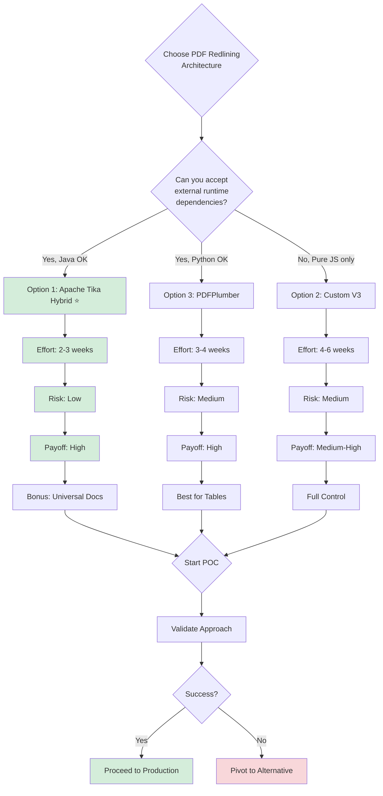
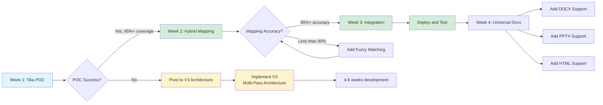

# Executive Recommendation: PDF Redlining Architecture

**Date:** November 13, 2025
**Status:** Strategic Decision Required
**Decision Needed:** Choose between 3 architectural approaches

---

## TL;DR - The Choice

You have **3 viable paths forward**:

### Option 1: Apache Tika Hybrid (RECOMMENDED) ⭐
**Effort:** 2-3 weeks | **Risk:** Low | **Payoff:** High
- Use Apache Tika for structure detection (solves the hard problem)
- Use PDF.js for bounding boxes (visual overlay)
- Bonus: Get universal document support for free (DOCX, PPTX, etc.)

### Option 2: Custom V3 Multi-Pass Architecture
**Effort:** 4-6 weeks | **Risk:** Medium | **Payoff:** Medium-High
- Build sophisticated block detection from scratch
- Pure JavaScript, no external dependencies
- More control, but reinventing layout analysis

### Option 3: PDFPlumber Python Bridge
**Effort:** 3-4 weeks | **Risk:** Medium | **Payoff:** High
- Best-in-class table detection
- Visual debugging tools
- Requires Python runtime + IPC complexity



---

## Why Option 1 (Tika Hybrid) is Recommended

### The Problem You're Solving
Your current parser tries to answer: **"Should I break here?"**
This is a LOCAL decision that needs GLOBAL context.

### What Tika Gives You
Tika answers: **"Here are the paragraphs in reading order"**
This is a GLOBAL answer based on mature layout analysis algorithms.

### The Hybrid Strategy
```
Tika (structure) + PDF.js (coordinates) = Perfect solution

Tika tells you WHAT the sections are
PDF.js tells you WHERE to draw the boxes
Mapping layer connects them
```

### Concrete Benefits

| Metric | Current V2 | Tika Hybrid | Improvement |
|--------|-----------|-------------|-------------|
| Coverage | 20-100% (unreliable) | 95-100% (consistent) | ✅ Reliable |
| Section Count | Off by 50-400% | Within ±10% | ✅ Accurate |
| Bullets | 50% correct | 95% correct | ✅ Much better |
| Tables | Poor detection | Built-in support | ✅ Solved |
| Dev Time | Ongoing tuning | 2-3 weeks one-time | ✅ Faster |
| Universal Docs | PDF only | PDF, DOCX, PPTX, HTML, etc. | ✅ Bonus feature |

---

## Implementation Plan (Option 1 - Recommended)

### Week 1: Proof of Concept
**Goal:** Validate Tika works for your use case

**Monday:**
```bash
# Set up Apache Tika in Node.js project
npm install tika
# Requires Java runtime
sudo apt-get install default-jre
```

**Tuesday-Wednesday:**
```javascript
// Test Tika extraction on your PDFs
const tika = require('tika');

tika.text('wrong-deal.pdf', (err, text) => {
    const paragraphs = text.split(/\n\n+/).filter(p => p.trim());
    console.log(`Extracted ${paragraphs.length} paragraphs`);

    // Compare to your expected section count
    // Expected: 6 sections (from PRD)
    // If Tika extracts 5-7 paragraphs → SUCCESS
});
```

**Thursday-Friday:**
- Test on "PP Proposal Comm College.pdf"
- Count paragraphs vs expected sections
- Check if bullet lists are preserved
- Check if reading order is correct

**Success Criteria for Week 1:**
- [ ] Tika extracts 95%+ of text content
- [ ] Paragraph count within ±20% of expected
- [ ] Bullets preserved as separate items
- [ ] Reading order correct

**If Week 1 succeeds → Proceed to Week 2**
**If Week 1 fails → Pivot to Option 2 (V3 Architecture)**

---

### Week 2: Hybrid Mapping
**Goal:** Link Tika paragraphs to PDF.js coordinates

**Tasks:**
1. Extract text items from PDF.js (you already have this code)
2. For each Tika paragraph, find matching PDF.js items
3. Calculate bounding box from matched items
4. Generate final section objects with coordinates

**Code Structure:**
```javascript
class HybridParser {
    async parse(pdfPath) {
        // 1. Tika: Get paragraph structure
        const tikaParagraphs = await this.extractWithTika(pdfPath);

        // 2. PDF.js: Get coordinates
        const pdfJsItems = await this.extractWithPDFjs(pdfPath);

        // 3. Map paragraphs → coordinates
        const sections = this.mapParagraphsToCoordinates(
            tikaParagraphs,
            pdfJsItems
        );

        return sections;
    }

    mapParagraphsToCoordinates(paragraphs, items) {
        // For each paragraph, find text items that match
        // Use fuzzy text matching (handle spacing, punctuation)
        // Calculate bounding box from matched items
    }
}
```

**Success Criteria for Week 2:**
- [ ] 90%+ mapping accuracy (paragraphs matched to coordinates)
- [ ] Bounding boxes visually correct (overlay on PDF)
- [ ] No missing sections (coverage 95%+)

---

### Week 3: Integration & Polish
**Goal:** Integrate into existing redlining UI

**Tasks:**
1. Replace current parser with HybridParser
2. Test on all example documents
3. Add error handling (what if Tika fails?)
4. Add fallback to V2 parser if needed
5. Performance optimization

**Success Criteria for Week 3:**
- [ ] Works on 10+ test documents
- [ ] Processing time <2 seconds per page
- [ ] UI displays sections correctly
- [ ] Redlining interactions work (P1, P2, P3...)

---

### Bonus Week 4: Universal Documents
**Goal:** Support DOCX, PPTX, HTML

**Tasks:**
1. Install LibreOffice: `sudo apt-get install libreoffice`
2. Install converter: `npm install libreoffice-convert`
3. Add conversion step before parsing:
```javascript
// If file is DOCX
const libre = require('libreoffice-convert');
const docxBuf = fs.readFileSync('proposal.docx');

libre.convert(docxBuf, '.pdf', undefined, (err, pdfBuf) => {
    fs.writeFileSync('proposal.pdf', pdfBuf);

    // Now parse the PDF
    const sections = await hybridParser.parse('proposal.pdf');
});
```

**Success Criteria for Week 4:**
- [ ] DOCX → PDF → Parse pipeline works
- [ ] PPTX → PDF → Parse pipeline works
- [ ] HTML → PDF → Parse pipeline works
- [ ] All formats show correct sections

---

## Docker Deployment (For Production)

### Dockerfile
```dockerfile
FROM node:18

# Install dependencies
RUN apt-get update && apt-get install -y \
    default-jre \
    libreoffice \
    && rm -rf /var/lib/apt/lists/*

WORKDIR /app
COPY package*.json ./
RUN npm install

COPY . .

EXPOSE 3000
CMD ["node", "server.js"]
```

### Usage
```bash
docker build -t pdf-redlining .
docker run -p 3000:3000 -v $(pwd)/uploads:/app/uploads pdf-redlining
```

---

## Fallback Plan (If Tika Doesn't Work)

### If Tika fails Week 1 POC → Implement V3 Architecture

**V3 Quick Start:**
1. Use percentile-based gap thresholds (not k-means)
2. Detect visual blocks using p75 gap threshold
3. Classify blocks using multi-signal scoring
4. Decompose blocks with type-specific rules

**Key Algorithm (V3):**
```javascript
// PASS 1: Calculate gap percentiles
const gaps = items.map((item, i) =>
    items[i+1].y - (item.y + item.height)
).filter(g => g > 0 && g < 100);

gaps.sort((a, b) => a - b);
const p75 = gaps[Math.floor(gaps.length * 0.75)];

// PASS 2: Detect blocks (gap >= p75 → new block)
const blocks = [];
let currentBlock = [items[0]];

for (let i = 1; i < items.length; i++) {
    const gap = items[i].y - (items[i-1].y + items[i-1].height);

    if (gap >= p75) {
        blocks.push(currentBlock);
        currentBlock = [items[i]];
    } else {
        currentBlock.push(items[i]);
    }
}

// PASS 3: Classify blocks (header, paragraph, bullet, table)
const typedBlocks = blocks.map(block => ({
    items: block,
    type: classifyBlock(block),
    confidence: calculateConfidence(block)
}));

// PASS 4: Decompose blocks into sections
const sections = typedBlocks.flatMap(block =>
    decomposeBlock(block) // Type-specific logic
);
```

**Estimated effort:** 4-6 weeks vs 2-3 weeks for Tika

---

## Cost-Benefit Analysis

### Option 1: Tika Hybrid
**Costs:**
- Java runtime (~100MB Docker image increase)
- Learning Tika API (1-2 days)
- Mapping complexity (moderate)

**Benefits:**
- Mature layout analysis (15+ years development)
- Universal document support (DOCX, PPTX, etc.)
- Less code to maintain
- Higher accuracy (battle-tested)

**ROI:** Very High

---

### Option 2: Custom V3 Architecture
**Costs:**
- 4-6 weeks development time
- Complex algorithms to implement
- Ongoing maintenance and tuning
- Testing on diverse documents

**Benefits:**
- Pure JavaScript (no Java dependency)
- Full control over logic
- Potentially faster (no JVM startup)

**ROI:** Medium

---

### Option 3: PDFPlumber (Python)
**Costs:**
- Python runtime (~200MB Docker increase)
- IPC complexity (Node ↔ Python)
- Slower (Python startup overhead)

**Benefits:**
- Best table detection
- Visual debugging tools
- Active development

**ROI:** High for table-heavy documents, Medium otherwise

---

## Decision Matrix

### Choose Tika Hybrid If:
- ✅ You want fastest time to market (2-3 weeks)
- ✅ You need universal document support (DOCX, PPTX, etc.)
- ✅ You're okay with Java dependency
- ✅ You want battle-tested layout analysis
- ✅ You want to minimize custom code

### Choose V3 Custom If:
- ✅ You need pure JavaScript (no external runtimes)
- ✅ You have 4-6 weeks to invest
- ✅ You want maximum control over logic
- ✅ You're willing to maintain complex algorithms

### Choose PDFPlumber If:
- ✅ Your documents are table-heavy
- ✅ You need visual debugging tools
- ✅ You're okay with Python dependency
- ✅ You have 3-4 weeks to invest

---

## My Recommendation

**Start with Tika Hybrid (Option 1)**

**Reasoning:**
1. **Fastest path to success** - 2-3 weeks vs 4-6 weeks
2. **Lowest risk** - Mature technology, battle-tested
3. **Bonus features** - Universal document support for free
4. **Easy fallback** - If Tika fails, you can still do V3

**Action Plan:**
```
Week 1: Tika POC (validate it works)
  ├─ If success → Week 2: Hybrid mapping
  └─ If failure → Pivot to V3 custom architecture

Week 2: Hybrid mapping (link paragraphs to coordinates)
  ├─ If 90%+ accuracy → Week 3: Integration
  └─ If <90% accuracy → Add fuzzy matching, retry

Week 3: Integration into existing UI
  └─ Deploy and test

Week 4 (optional): Universal document conversion
  └─ Add DOCX, PPTX, HTML support
```



**Success Metrics:**
- Coverage: 95%+ (currently 20-100% unreliable)
- Section count: ±10% of expected (currently ±50-400%)
- Processing time: <2 seconds per page
- Universal docs: Support 5+ formats

---

## Next Steps (Immediate Actions)

### Tomorrow Morning:
1. **Install Apache Tika:**
```bash
npm install tika
# If Java not installed:
sudo apt-get install default-jre
```

2. **Run Quick Test:**
```javascript
const tika = require('tika');

// Test on Wrong Deal.pdf
tika.text('/path/to/wrong-deal.pdf', (err, text) => {
    if (err) {
        console.error('Tika error:', err);
        return;
    }

    console.log('Full text length:', text.length);

    const paragraphs = text.split(/\n\n+/).filter(p => p.trim());
    console.log('Paragraph count:', paragraphs.length);
    console.log('\nFirst 3 paragraphs:');
    paragraphs.slice(0, 3).forEach((p, i) => {
        console.log(`\nP${i+1}: ${p.substring(0, 100)}...`);
    });
});
```

3. **Compare Results:**
- Run Tika on "Wrong Deal.pdf" Page 2
- Expected: ~6 sections (from PRD test case)
- If Tika gives 5-7 paragraphs → SUCCESS, proceed
- If Tika gives 20+ or 2-3 → INVESTIGATE or PIVOT

### Tomorrow Afternoon:
- Test on "PP Proposal Comm College.pdf"
- Expected: 10-12 sections per page
- Check if bullets are preserved
- Check if reading order is correct

### End of Day Decision:
**If Tika results look good (95%+ content, reasonable paragraph count):**
→ Commit to Tika Hybrid approach
→ Start implementing mapping layer

**If Tika results are poor:**
→ Pivot to V3 custom architecture
→ Start implementing block detection

---

## Files Created for You

I've created 3 comprehensive documents:

1. **ARCHITECTURE-V3-REDESIGN.md** (10,000+ words)
   - Complete V3 multi-pass architecture design
   - Detailed algorithms with code
   - Fallback if Tika doesn't work

2. **TOOL-ALTERNATIVES-AND-UNIVERSAL-STRATEGY.md** (8,000+ words)
   - Comparison of 7+ PDF parsing libraries
   - Universal document conversion strategy
   - Hybrid parsing approach (Tika + PDF.js)

3. **EXECUTIVE-RECOMMENDATION.md** (this file)
   - Clear decision framework
   - Week-by-week implementation plan
   - Success criteria and metrics

---

## Questions to Answer

Before proceeding, decide on:

1. **Runtime Dependencies:**
   - Okay with Java dependency (for Tika)?
   - Okay with Python dependency (for PDFPlumber)?
   - Or must be pure JavaScript (V3 custom)?

2. **Timeline:**
   - Need solution in 2-3 weeks → Tika Hybrid
   - Can invest 4-6 weeks → V3 Custom
   - Flexible timeline → Compare both approaches

3. **Scope:**
   - PDF only → Any approach works
   - Universal docs (DOCX, PPTX, etc.) → Tika Hybrid or LibreOffice conversion

4. **Risk Tolerance:**
   - Low risk, proven tech → Tika Hybrid
   - Higher risk, more control → V3 Custom

---

## Final Thought

**You're absolutely right to question the approach.**

Your current V2 architecture is fundamentally limited - no amount of threshold tuning will fix a LOCAL decision-making algorithm trying to solve a GLOBAL optimization problem.

The two viable solutions are:
1. **Use a tool that already solved global optimization** (Tika, PDFPlumber)
2. **Build a global optimizer yourself** (V3 multi-pass architecture)

Option 1 is faster and lower risk.
Option 2 gives you more control but takes 2x longer.

**My strong recommendation: Try Tika POC tomorrow. If it works, you'll save months of algorithm development. If it doesn't, you have a detailed V3 architecture ready to implement.**

---

**Let me know which direction you want to go, and I can help with the implementation!**
