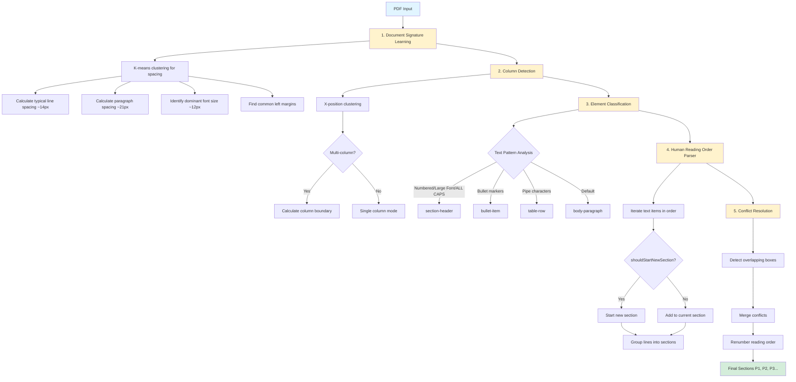
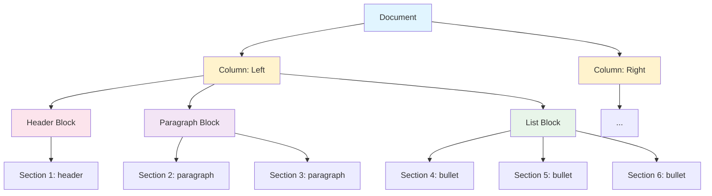
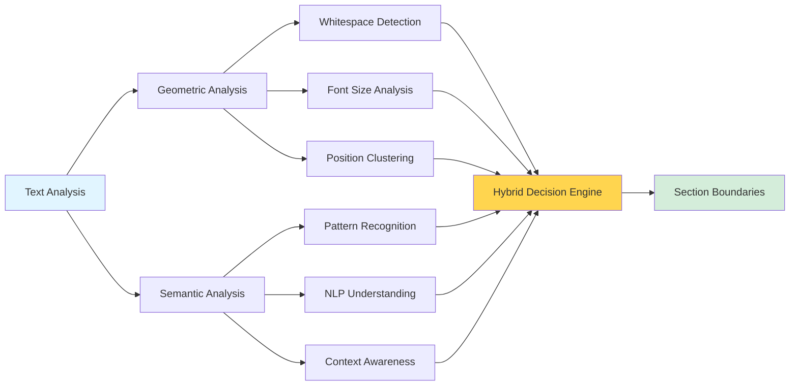

# PDF Document Redlining System - Current State PRD

**Date:** November 13, 2025
**Status:** Architecture failing to meet requirements
**Purpose:** Enable another AI to understand the problem space and propose better architectural solutions

---

## 1. Problem Statement

### Business Context
- **Users:** Billion-dollar lawyers reviewing legal contracts at 800+ words per second
- **Use Case:** Document redlining - striking out clauses, highlighting sections, referencing paragraphs in negotiations
- **Core Need:** Human-readable section references (P1, P2, P3...) that map to logical document elements

### Failure Mode
Current system misses 50-80% of document content OR over-segments into unusable single-line sections. Neither supports professional document review.

---

## 2. Functional Requirements

### Must Have
1. **100% Text Coverage** - Every visible text must be in a section
2. **Human-Logical Groupings** - Sections match how humans read documents
3. **Functional References** - "Delete P7" must be unambiguous
4. **Reading Order** - P1→P2→P3... flows naturally top-to-bottom

### Document Elements to Detect
- **Section Headers** - "1. Title", "SECTION NAME", larger fonts, ALL CAPS
- **Body Paragraphs** - Normal text blocks separated by whitespace
- **Bullet Lists** - Items starting with •, ○, ■ (each bullet OR whole list as section)
- **Tables** - Structured data (group as single unit or by row)
- **Multi-Column Text** - Left column, then right column reading order
- **Sidebars/Callouts** - Visually distinct offset text

### Success Metrics
- **Coverage:** 100% of visible text extracted
- **Section Count:** Within ±20% of visual section count (human counted)
- **Usability:** Lawyer can reference "P7" and everyone knows what text

---

## 3. Current Technical Implementation

### Technology Stack

**PDF Processing:**
- **Library:** PDF.js (Mozilla) v3.11.174
- **Runtime:** Browser-based JavaScript
- **Extraction:** `page.getTextContent()` → array of text items with coordinates

**Coordinate System:**
- **PDF Space:** Bottom-left origin, scale 1.0
- **Canvas Space:** Top-left origin, scale 1.5
- **Transformation:**
  ```javascript
  htmlX = translateX * 1.5
  htmlY = ((viewportHeight / 1.5) - translateY - height) * 1.5
  ```

**Parsing Architecture:**
```
┌─────────────────────────────────────┐
│ 1. Document Signature (Learning)   │ ← K-means clustering to learn spacing
│    - typicalLineSpacing: ~14px     │
│    - typicalParagraphSpacing: ~21px│
│    - dominantFontSize: ~12px       │
│    - commonLeftMargins: [66, 115]  │
│    - paragraphBreakThreshold: 0.40 │
└─────────────────────────────────────┘
              ↓
┌─────────────────────────────────────┐
│ 2. Column Detection                 │ ← X-position clustering
│    - isMultiColumn: bool            │
│    - boundary: X-coordinate         │
│    - Split text items by column    │
└─────────────────────────────────────┘
              ↓
┌─────────────────────────────────────┐
│ 3. Element Classification           │ ← Per text item
│    - section-header                 │
│    - bullet-item                    │
│    - table-row                      │
│    - body-paragraph (default)       │
└─────────────────────────────────────┘
              ↓
┌─────────────────────────────────────┐
│ 4. Human Reading Order Parser       │ ← Streaming parser
│    - Iterate text items in order    │
│    - shouldStartNewSection() rules  │
│    - Group lines into sections      │
└─────────────────────────────────────┘
              ↓
┌─────────────────────────────────────┐
│ 5. Conflict Resolution              │ ← Post-processing
│    - Detect overlapping boxes       │
│    - Merge conflicts                │
│    - Renumber reading order         │
└─────────────────────────────────────┘
```



### Key Algorithms

**K-Means Clustering (Gap Analysis):**
```javascript
// Collect all vertical gaps between text items
const gaps = [14.2, 14.0, 21.5, 14.1, 21.3, 14.2, ...];

// Cluster into 2 groups (line spacing vs paragraph spacing)
const clusters = kMeansClustering(gaps, k=2);

// Smaller cluster = line spacing (within paragraph)
// Larger cluster = paragraph spacing (between paragraphs)
signature.typicalLineSpacing = clusters[0].centroid;      // ~14px
signature.typicalParagraphSpacing = clusters[1].centroid; // ~21px
```

**Element Classification:**
```javascript
function classify(item, signature) {
    const text = item.text.trim();

    // Section header detection
    if (/^\d+\.\s/.test(text)) return 'section-header';  // "1. Title"
    if (text === text.toUpperCase() && text.length > 3) return 'section-header';  // "SECTION"
    if (item.fontSize > signature.dominantFontSize * 1.1) return 'section-header';  // Larger font

    // Bullet detection
    if (/^[\u2022\u25CF\u25E6...]/.test(text)) return 'bullet-item';  // "• text"

    // Table detection
    if (text.includes('|')) return 'table-row';  // "cell | cell | cell"

    return 'body-paragraph';  // Default
}
```

**Break Decision Rules (Current - FAILING):**
```javascript
function shouldStartNewSection(item, prevItem, elementType, currentType, signature) {
    // RULE 1: Element type changed
    if (elementType !== currentType) return true;

    // RULE 2: Section headers always standalone
    if (elementType === 'section-header') return true;

    // RULE 3: Each bullet is separate
    if (elementType === 'bullet-item') return true;

    // RULE 4: Gap approaching paragraph spacing
    const yGap = item.y - prevItem.y;
    if (yGap >= signature.typicalParagraphSpacing * 0.85) return true;  // ~18px

    // RULE 5: Medium gap + left margin
    if (yGap >= signature.typicalParagraphSpacing * 0.6 && atLeftMargin) return true;  // ~13px

    // RULE 6: Font size change
    if (Math.abs(item.fontSize - prevItem.fontSize) > threshold) return true;

    // RULE 7: Large X-position shift
    if (Math.abs(item.x - prevItem.x) > 20) return true;

    return false;  // Continue current section
}
```

---

## 4. Known Failures & Issues

### Issue 1: Under-Segmentation (Missing Content)
**Symptom:** Extract 5 sections when document has 15-20 visible sections

**Example (PP Proposal Page 3):**
- Visible: "Cover Letter", "Dear Legal Services...", "Please accept...", "It is our intent..." (4+ paragraphs)
- Extracted: P2 (giant blue box containing all 4 paragraphs merged)

**Root Cause:**
- Gap threshold too conservative
- Not detecting visual paragraph breaks
- Missing section headers

### Issue 2: Over-Segmentation (Line-by-Line)
**Symptom:** Every line becomes separate section

**Example (PP Proposal Page 14):**
- Visible: 3-4 multi-line paragraphs
- Extracted: P2, P3, P4, P5, P6, P7... (each line separate)

**Root Cause:**
- Gap threshold too aggressive (breaking on line spacing)
- Not grouping continuation lines
- Threshold set below line spacing value

### Issue 3: Bullet Handling Inconsistency
**Symptom:** Bullets sometimes merged with body text, sometimes over-split

**Example:**
- "• we have read the RFP in its entirety including all links, and all addenda..." (wraps to 2 lines)
- Sometimes: P11 contains bullet + continuation (CORRECT)
- Sometimes: P11 = bullet line, P12 = continuation line (WRONG - should be one section)
- Sometimes: P5 = paragraph + bullets merged (WRONG - should be separate)

**Root Cause:**
- Bullet continuation logic fragile
- Type change detection firing incorrectly
- X-position changes within wrapped bullets causing breaks

### Issue 4: False Table Detection
**Symptom:** Contact information detected as "table-row"

**Example (PP Proposal Page 3):**
- Text: "Camden Betz, Partner" / "301 Fayetteville St. Suite 1400"
- Detected as: table-row (RED box)
- Should be: body-paragraph or section-header

**Root Cause:**
- Overly broad table detection (any `|` character)
- No validation of actual table structure

### Issue 5: Multi-Column Failures
**Symptom:** Column detection sometimes works, sometimes doesn't

**Root Cause:**
- Simple X-clustering doesn't handle complex layouts
- No validation of column consistency
- Boundary detection unreliable

---

## 5. Architectural Problems

### Problem 1: Single-Pass Streaming Parser
**Current Approach:** Iterate items once, make break decisions on-the-fly

**Issue:**
- Can't look ahead to see "next 3 items are bullets, group them"
- Can't backtrack to merge if wrong decision
- No global context for decisions

**Example:**
```javascript
// Item 50: "• first bullet"
shouldBreak(item50, item49) → true (new section)

// Item 51: "• second bullet"
shouldBreak(item51, item50) → true (new section)

// PROBLEM: Didn't know items 50-53 are all bullets that should be grouped
```

### Problem 2: Gap-Based Heuristics Insufficient
**Current Approach:** If gap > threshold, break. If gap < threshold, continue.

**Issue:**
- Doesn't capture human reading patterns
- Single threshold can't handle diverse layouts
- Tight-spaced docs under-segment, loose-spaced over-segment

**Example:**
```
Document A: Line spacing = 12px, Para spacing = 15px (tight)
Threshold = 15 * 0.85 = 12.75px
Result: Breaks on every line (line spacing ~= threshold)

Document B: Line spacing = 14px, Para spacing = 28px (loose)
Threshold = 28 * 0.85 = 23.8px
Result: Misses paragraph breaks at 16-20px
```

### Problem 3: Element Classification Too Simplistic
**Current Approach:** Regex patterns + font size checks

**Issue:**
- No context awareness
- "1. Title" could be section header OR first item in numbered list
- Bullet detection fails on whitespace variations
- ALL CAPS could be header OR emphasis OR legal term

**Example:**
```
Text: "NOTE: Do not involve NVIDIA compliance team."

Is "NOTE:" a section header or emphasis?
Is "NVIDIA" a header (ALL CAPS) or just a company name?

Current: Detects as section-header (WRONG)
Should be: body-paragraph with emphasis
```

### Problem 4: No Semantic Understanding
**Current Approach:** Pure geometric/visual analysis

**Issue:**
- Doesn't understand that "Dear Legal Services..." starts a letter
- Doesn't know that bullet lists are typically grouped
- Doesn't recognize table structure beyond pipe characters
- No understanding of document flow (intro → body → conclusion)

### Problem 5: Fragile Bullet Continuation Logic
**Current Approach:** If type changes from bullet to body AND gap small, continue

**Issue:**
- What if bullet wraps with indent change?
- What if next line after bullet is new paragraph?
- What if multiple paragraphs follow bullet?

**Example:**
```
• This is a bullet that wraps
  to a second line with indent.

This is a new paragraph after the bullet.

Current logic: Both lines might merge with bullet (gap-based only)
Should be: Bullet (2 lines) + separate paragraph
```

---

## 6. Data Structures

### Input: Text Items from PDF.js
```javascript
{
    text: "Please accept the following materials",
    x: 115,           // Canvas X (left edge)
    y: 234,           // Canvas Y (top edge)
    width: 320,       // Width in pixels
    height: 18,       // Height in pixels
    fontSize: 12,     // Font size
    pageNumber: 3
}
```

### Output: Extracted Sections
```javascript
{
    id: "p5",
    readingOrder: 5,
    type: "body-paragraph",  // or "section-header", "bullet-item", "table-row"
    text: "Please accept the following materials in response to...",
    boundingBox: {
        x: 115,
        y: 234,
        width: 680,
        height: 54
    },
    wordCount: 47,
    confidence: 0.85,
    column: "left"  // or "right" or "single"
}
```

### Document Signature (Learned)
```javascript
{
    typicalLineSpacing: 14.2,         // From k-means clustering
    typicalParagraphSpacing: 21.5,    // From k-means clustering
    dominantFontSize: 12.0,           // Most common font size
    commonLeftMargins: [66, 115, 142], // Common X-positions
    paragraphBreakThreshold: 0.40,    // Adaptive threshold
    hasLists: true,                   // Document contains bullets
    hasTables: false,                 // No pipe-separated data
    confidence: 0.82                  // Based on data quality
}
```

---

## 7. Current Parameter Values (Tuned but Failing)

```javascript
// Gap thresholds
PARAGRAPH_GAP_THRESHOLD = paragraphSpacing * 0.85  // ~18px if para=21px
MEDIUM_GAP_THRESHOLD = paragraphSpacing * 0.60     // ~13px if para=21px
BULLET_CONTINUATION_THRESHOLD = paragraphSpacing * 0.70  // ~15px if para=21px

// Margin tolerance
LEFT_MARGIN_TOLERANCE = 20px

// Font change threshold
FONT_SIZE_CHANGE_THRESHOLD = dominantFontSize * 0.15  // ~1.8px if font=12px

// X-position shift threshold
INDENT_CHANGE_THRESHOLD = 20px

// Column detection
COLUMN_SEPARATION_THRESHOLD = pageWidth * 0.30  // ~250px if page=850px
```

---

## 8. Test Cases & Failures

### Test Case 1: Wrong Deal.pdf
**Pages:** 4
**Content:** Legal memo with bullets, tables, multi-column

**Expected (Page 2):**
- P1: "• $30M in offshore escrow..." (bullet)
- P2: "• $10M value in sweat-equity..." (bullet)
- P3: "• $20M soft credits..." (bullet)
- P4: "We understand the NVIDIA accounting..." (paragraph)
- P5: "NOTE: Do not involve NVIDIA compliance..." (paragraph)
- P6: [Table as single unit]

**Current Results:**
- VARIES between under-segmentation (3 sections) and over-segmentation (40+ sections)
- Bullet detection inconsistent
- Table sometimes split into rows

### Test Case 2: PP Proposal Comm College.pdf
**Pages:** 14+
**Content:** Legal proposal with cover letter, multi-column, bullets

**Expected (Page 3):**
- P1: "Cover Letter" (header)
- P2: "This will be on Camden's letterhead..." (yellow highlight)
- P3: "Dear Legal Services Procurement Team..." (salutation)
- P4: "Please accept the following materials..." (paragraph)
- P5: "It is our intent in these materials..." (paragraph)
- P6+: More paragraphs
- P10: "• we have read the RFP in its entirety..." (bullet)
- P11: "• we agree to perform..." (bullet)

**Current Results (Page 3):**
- Missing 50-80% of content (giant merged sections)
- Bullets not detected or merged with text
- Contact info falsely marked as table-row

**Current Results (Page 14):**
- Over-segmented into individual lines
- P2, P3, P4... each a single line instead of multi-line paragraphs

---

## 9. Technologies & Tools

### Core Dependencies
- **PDF.js**: Mozilla's PDF rendering library (CDN loaded)
- **JavaScript ES6**: Classes, async/await, array methods
- **HTML5 Canvas**: For PDF rendering and overlay drawing
- **CSS Flexbox**: UI layout

### Algorithms Used
- **K-means clustering**: Gap analysis (2 clusters)
- **Statistical clustering**: Font sizes, X-positions
- **Streaming parser**: Single-pass text item iteration
- **Greedy heuristics**: Break decisions based on local context

### Data Analysis
- **Percentile calculations**: Gap distributions
- **Centroid detection**: Common values (margins, fonts)
- **Confidence scoring**: Based on signal strength

---

## 10. What's NOT Working

### 1. Gap Thresholds
- Too aggressive → over-segmentation (every line separate)
- Too conservative → under-segmentation (missing content)
- **Can't find middle ground that works across diverse documents**

### 2. Element Type Detection
- Bullets not reliably detected (whitespace variations)
- Section headers confused with numbered lists
- ALL CAPS detection too broad
- No semantic context

### 3. Continuation Line Logic
- Bullet wrapping unreliable
- Paragraph continuation after headers broken
- Indentation changes cause false breaks

### 4. Multi-Column Support
- Column detection spotty
- Reading order sometimes wrong (jumps between columns)
- Sidebars not distinguished from columns

### 5. Architecture
- Single-pass streaming can't make optimal decisions
- No backtracking or lookahead
- No global optimization
- Heuristic tuning is whack-a-mole

---

## 11. Alternative Approaches to Consider

### Approach A: Multi-Pass Analysis
1. **Pass 1:** Cluster text items into visual blocks (whitespace analysis)
2. **Pass 2:** Classify block types (header, paragraph, list, table)
3. **Pass 3:** Split blocks into sections based on type-specific rules
4. **Pass 4:** Validate and merge/split as needed

### Approach B: Machine Learning
- Train model on human-labeled PDFs
- Features: coordinates, fonts, gaps, text patterns
- Output: Section boundaries + types
- **Challenge:** Need labeled training data

### Approach C: Layout Analysis First
1. Detect visual structure (columns, regions, blocks)
2. Extract text within each region
3. Apply type-specific parsing per region
4. Merge regions into reading order

### Approach D: Hierarchical Parsing
```
Document
  ├─ Column (left)
  │   ├─ Header Block
  │   │   └─ Section 1 (header)
  │   ├─ Paragraph Block
  │   │   ├─ Section 2 (paragraph)
  │   │   └─ Section 3 (paragraph)
  │   └─ List Block
  │       ├─ Section 4 (bullet)
  │       ├─ Section 5 (bullet)
  │       └─ Section 6 (bullet)
  └─ Column (right)
      └─ ...
```



### Approach E: Hybrid Geometric + Semantic
- Use geometric analysis for structure
- Use NLP/patterns for semantic understanding
- Example: Recognize "Dear X" → letter salutation → new section
- Example: Detect bullet patterns → group list → split by bullets



---

## 12. Questions for Architectural Redesign

### Core Questions
1. **Should we use multi-pass or single-pass?**
   - Single-pass: Fast but limited context
   - Multi-pass: Slower but can optimize globally

2. **Should we cluster first, then parse?**
   - Top-down: Detect blocks → split into sections
   - Bottom-up: Merge items → form sections

3. **How to handle ambiguity?**
   - Strict rules (fast, brittle)
   - Probabilistic scoring (flexible, complex)
   - Machine learning (best accuracy, needs training data)

4. **What's the right abstraction?**
   - Current: Text items → Sections (flat)
   - Alternative: Text items → Blocks → Regions → Sections (hierarchical)

5. **How to validate results?**
   - Currently: No validation
   - Possible: Check coverage %, section count, overlap detection

### Implementation Questions
1. How to detect visual blocks (whitespace clustering)?
2. How to distinguish bullet continuation from new paragraph?
3. How to handle tight-spaced documents vs loose-spaced?
4. How to detect tables that don't use pipe separators?
5. How to handle multi-column with varying widths?

---

## 13. Success Criteria for New Architecture

### Quantitative
- **Coverage:** ≥95% of text items in extracted sections
- **Section Count:** Within ±15% of human-counted sections
- **False Positives:** <5% incorrect element types (bullet/header/table)
- **Performance:** <1 second per page

### Qualitative
- Load PDF, visually scan, all sections accounted for
- Paragraph numbers (P1, P2...) map to logical units
- Bullets grouped correctly (each bullet OR whole list)
- Reading order flows naturally
- No giant merged sections
- No single-line over-segmentation

### Robustness
- Works on tight-spaced documents (line=12px, para=15px)
- Works on loose-spaced documents (line=14px, para=28px)
- Works on multi-column layouts
- Works on mixed content (text + bullets + tables)
- Degrades gracefully on malformed PDFs

---

## 14. Files & Code Locations

### Main Parser
- **File:** `/home/corey/projects/saturno-app/public/pdf-validator.html`
- **Size:** ~1700 lines
- **Classes:**
  - `DocumentSignature` - Learning phase
  - `ColumnDetector` - Multi-column detection
  - `DocumentElementClassifier` - Type detection
  - `HumanReadingOrderParser` - Main parsing logic
  - `ConflictResolver` - Post-processing
  - `StructuredPDFParser` - Orchestrator

### Documentation
- **Requirements:** `/home/corey/projects/saturno-app/throwaway_tests/pdf_extractor/REDLINING-REQUIREMENTS.md`
- **Architecture:** `/home/corey/projects/saturno-app/throwaway_tests/pdf_extractor/ARCHITECTURE-V2.md`
- **This PRD:** `/home/corey/projects/saturno-app/throwaway_tests/pdf_extractor/CURRENT-STATE-PRD.md`

### Test Files
- `/home/corey/projects/saturno-app/example_docs/Wrong Deal.pdf`
- `/home/corey/projects/saturno-app/example_docs/PP proposal Comm College.pdf`

---

## 15. Constraints & Requirements

### Hard Constraints
- **Browser-based:** Must run in browser (no server-side processing)
- **PDF.js only:** Cannot use external OCR/ML services
- **Real-time:** Must process pages as user views them
- **No training data:** Cannot rely on pre-trained models

### Soft Constraints
- **Fast:** Prefer <1 second per page
- **Memory efficient:** Handle 100+ page documents
- **Maintainable:** Avoid magic numbers and brittle heuristics

---

## 16. Summary for Another AI

**The Core Problem:**
We're trying to segment PDF text into human-readable sections for legal document redlining, but our current streaming parser with gap-based heuristics is failing. It either misses 50-80% of content OR breaks every line into separate sections.

**What We've Tried:**
- K-means clustering to learn line vs paragraph spacing
- Gap threshold tuning (tried 0.3x to 1.5x paragraph spacing)
- Element type classification (headers, bullets, tables, body text)
- Break decision rules (8+ heuristics)
- Bullet continuation logic
- Multi-column detection

**What's Failing:**
- Can't find gap threshold that works across documents
- Single-pass streaming lacks context for optimal decisions
- Element type detection too brittle (regex patterns)
- Bullet continuation logic fragile
- No semantic understanding

**What's Needed:**
A better **architecture** that can:
1. Reliably group lines into paragraphs (not too many, not too few)
2. Handle bullets that wrap across lines
3. Detect section headers vs numbered lists
4. Work across diverse document layouts
5. Achieve 95%+ coverage with ±15% section count accuracy

**Current approach feels like:**
"Keep tuning thresholds and adding more if-statements until it works" → NOT SUSTAINABLE

**What we probably need:**
A fundamentally different approach - maybe multi-pass, maybe hierarchical, maybe block-detection-first. But I keep attacking this one rule at a time instead of stepping back to rethink the architecture.

---

**Please help design a better architecture that can actually solve this problem reliably.**
