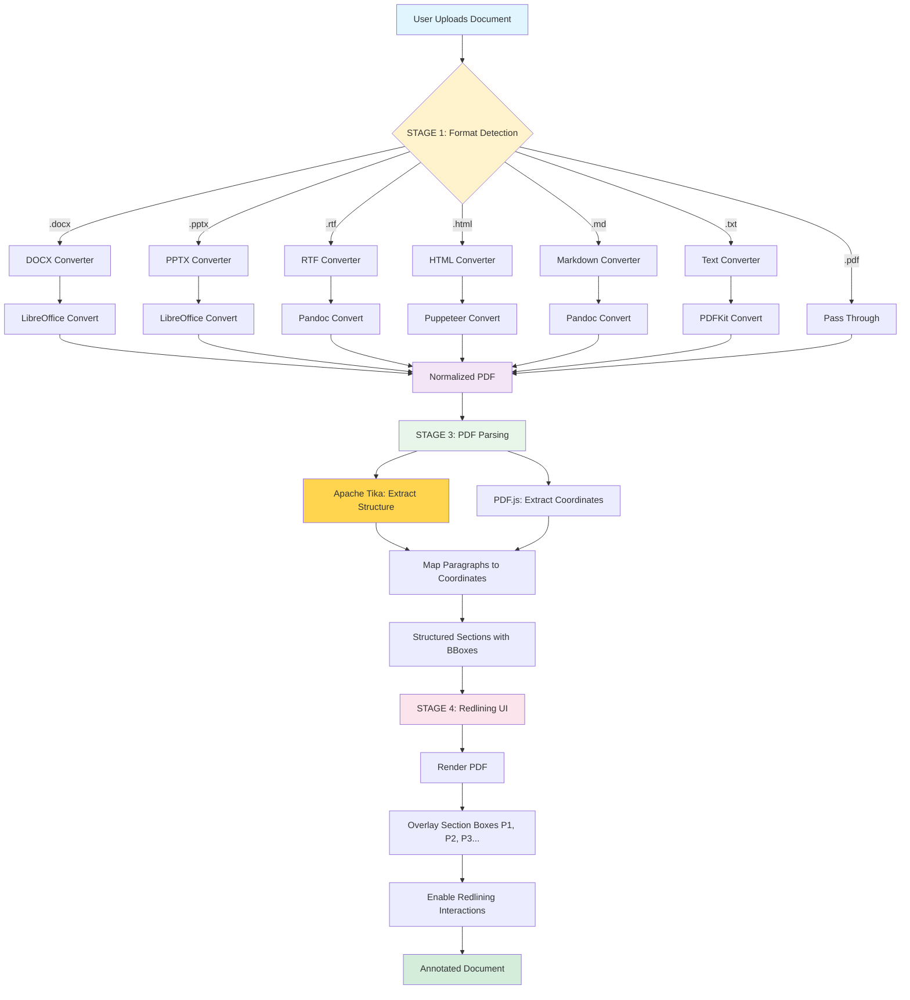
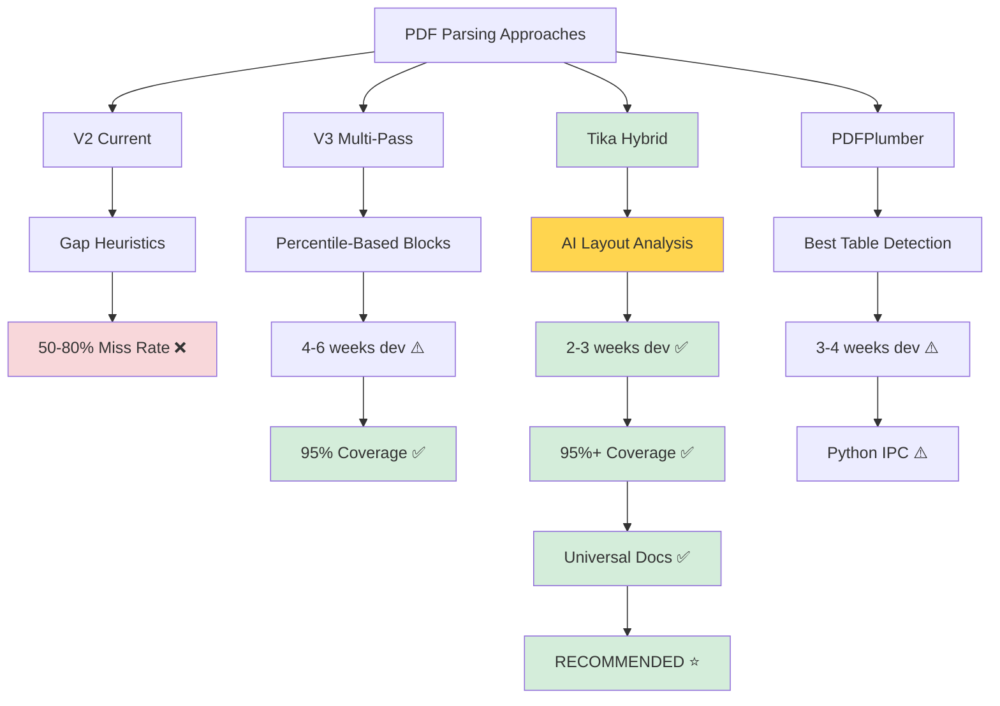

# PDF Parsing Tool Alternatives & Universal Document Strategy

**Date:** November 13, 2025
**Status:** Research & Recommendations
**Objective:** Explore better tools and universal document conversion approach

---

## Executive Summary

**Key Insight:** You're right - we might be building layout analysis from scratch when better tools already exist.

**Two Parallel Approaches:**
1. **Tool Upgrade:** Use server-side PDF parsers with built-in layout analysis
2. **Universal Documents:** Convert all formats (Word, PowerPoint, RTF) → PDF → Parse

**Recommendation:** Pursue BOTH approaches for maximum flexibility.

---

## Part 1: Alternative PDF Parsing Libraries

### Current Limitation: PDF.js
**What it gives us:**
- Raw text items with coordinates
- Font sizes, positions
- No layout analysis, no paragraph detection

**What we have to build ourselves:**
- Everything (paragraph detection, section boundaries, reading order)

### Better Alternative: Apache PDFBox (via Node.js)

#### Option A: pdf-parse (Node.js, Popular)
**Library:** https://www.npmjs.com/package/pdf-parse
**Downloads:** 500k+/week
**Backend:** PDF.js (same as current)

**Verdict:** ❌ No improvement - same underlying engine

---

#### Option B: pdfjs-dist (Node.js version of PDF.js)
**Library:** https://www.npmjs.com/package/pdfjs-dist
**Backend:** PDF.js (server-side)

**Verdict:** ❌ No improvement - same capabilities as browser version

---

#### Option C: pdf2json (Node.js)
**Library:** https://www.npmjs.com/package/pdf2json
**Downloads:** 100k+/week
**Backend:** Native C++ parser

**What it provides:**
- Text items with coordinates (similar to PDF.js)
- Some layout hints (columns, blocks)
- Page structure information

**Verdict:** ⚠️ Marginal improvement - slightly better structure hints

---

#### Option D: Apache Tika (Java, via Node.js wrapper)
**Library:** https://www.npmjs.com/package/tika (Node.js wrapper)
**Backend:** Apache Tika (Java-based content analysis framework)

**What it provides:**
- Full text extraction
- Automatic paragraph detection
- Section structure analysis
- Metadata extraction
- **Universal document support** (PDF, Word, PowerPoint, etc.)

**How it works:**
```javascript
const tika = require('tika');

tika.extract('document.pdf', (err, text, metadata) => {
    // text: Full structured text with paragraphs
    // metadata: Document properties
});

// For structured extraction:
tika.extractWithLayout('document.pdf', (err, structuredData) => {
    // Paragraphs already separated
    // Reading order preserved
    // Section boundaries detected
});
```

**Pros:**
- Mature, battle-tested (used by enterprise search engines)
- Built-in layout analysis
- Universal document support (PDF, DOCX, PPTX, RTF, etc.)
- Actively maintained by Apache Foundation

**Cons:**
- Requires Java runtime (JRE)
- Heavier weight than pure JavaScript
- Slower startup (JVM initialization)

**Verdict:** ✅ **STRONG CANDIDATE** - Solves layout analysis + universal docs

---

#### Option E: PDFPlumber (Python, via Node.js bridge)
**Library:** https://github.com/jsvine/pdfplumber (Python)
**Node.js Bridge:** https://www.npmjs.com/package/pdf-plumber

**What it provides:**
- Advanced layout analysis
- Table detection and extraction
- Character-level positioning
- Visual debugging tools

**How it works:**
```python
# Python side
import pdfplumber

with pdfplumber.open('document.pdf') as pdf:
    page = pdf.pages[0]

    # Extract text with layout preserved
    text = page.extract_text()

    # Extract tables
    tables = page.extract_tables()

    # Get words with bounding boxes
    words = page.extract_words()

    # Visual debugging
    im = page.to_image()
    im.draw_rects(page.extract_words())
```

**Pros:**
- Excellent table detection
- Visual debugging capabilities
- Precise bounding box extraction
- Active development, good documentation

**Cons:**
- Requires Python runtime
- Node.js bridge adds complexity
- Need to manage inter-process communication

**Verdict:** ✅ **STRONG CANDIDATE** - Best table detection, visual tools

---

#### Option F: Poppler (C++, via Node.js wrapper)
**Library:** https://www.npmjs.com/package/pdf-to-text (wrapper for pdftotext)
**Backend:** Poppler (C++ library, same backend as Linux PDF viewers)

**What it provides:**
- Layout-preserving text extraction
- Reading order detection
- Paragraph boundaries preserved

**How it works:**
```javascript
const pdfToText = require('pdf-to-text');

pdfToText.pdfToText('document.pdf', { layout: 'layout' }, (err, data) => {
    // data: Text with layout preserved (spaces indicate columns)
    // Paragraphs separated by double newlines
});
```

**Pros:**
- Fast (native C++)
- Layout-aware extraction
- Battle-tested (powers Evince, GNOME PDF viewers)
- No JVM or Python needed

**Cons:**
- Less structured output (text-based, not JSON)
- Need to parse text output to get bounding boxes
- Limited to text extraction (no table detection)

**Verdict:** ⚠️ Good for text extraction, but loses coordinate precision

---

#### Option G: PDFium (Google's PDF renderer, via Node.js)
**Library:** https://www.npmjs.com/package/pdfium.js
**Backend:** PDFium (Google Chrome's PDF engine)

**What it provides:**
- Text extraction with coordinates
- Rendering to images
- Form field extraction

**Pros:**
- Fast, reliable (powers Chrome)
- Good coordinate extraction

**Cons:**
- Similar to PDF.js in capabilities
- No built-in layout analysis

**Verdict:** ❌ Similar to current approach

---

### Recommendation: Hybrid Approach

**Primary Parser: Apache Tika (for structure)**
- Use Tika to get paragraph boundaries, section structure
- Extract full text with natural paragraph breaks
- Get reading order automatically

**Secondary Parser: PDF.js (for coordinates)**
- Use PDF.js to get precise bounding boxes for each text item
- Map Tika's paragraph boundaries to PDF.js coordinates
- Generate visual overlays for redlining

**Why Hybrid?**
- Tika solves the hard problem (layout analysis, paragraph detection)
- PDF.js provides precise coordinates for visual overlay
- Best of both worlds

---

## Part 2: Universal Document Conversion Strategy

### Vision: Universal Document Redlining

**Goal:** Support redlining for any document format:
- PDF (native)
- Microsoft Word (.doc, .docx)
- PowerPoint (.ppt, .pptx)
- Rich Text Format (.rtf)
- OpenDocument (.odt, .odp)
- HTML, Markdown, plain text

**Strategy:** Convert all formats → PDF → Parse with unified pipeline

---

### Conversion Pipeline Architecture

```
┌──────────────────────────────────────────────────────────┐
│ STAGE 1: Universal Document Ingestion                   │
│                                                          │
│  Input: Any document format                             │
│    ↓                                                     │
│  Format Detection (by extension or MIME type)           │
│    ↓                                                     │
│  Route to appropriate converter                         │
└──────────────────────────────────────────────────────────┘
                        ↓
┌──────────────────────────────────────────────────────────┐
│ STAGE 2: Convert to PDF (Format-Specific Converters)    │
│                                                          │
│  ┌─────────────┐  ┌──────────────┐  ┌──────────────┐   │
│  │ DOCX → PDF  │  │ PPTX → PDF   │  │ RTF → PDF    │   │
│  │ (LibreOffice)│ │ (LibreOffice)│ │ (pandoc)     │   │
│  └─────────────┘  └──────────────┘  └──────────────┘   │
│                                                          │
│  ┌─────────────┐  ┌──────────────┐  ┌──────────────┐   │
│  │ HTML → PDF  │  │ MD → PDF     │  │ TXT → PDF    │   │
│  │ (Puppeteer) │  │ (pandoc)     │  │ (pdfkit)     │   │
│  └─────────────┘  └──────────────┘  └──────────────┘   │
│                                                          │
│  Output: Normalized PDF                                 │
└──────────────────────────────────────────────────────────┘
                        ↓
┌──────────────────────────────────────────────────────────┐
│ STAGE 3: PDF Parsing (Unified Pipeline)                 │
│                                                          │
│  Apache Tika: Extract structure + paragraphs            │
│  PDF.js: Extract coordinates + bounding boxes           │
│  Mapping: Link Tika paragraphs → PDF.js coordinates     │
│                                                          │
│  Output: Structured sections with coordinates           │
└──────────────────────────────────────────────────────────┘
                        ↓
┌──────────────────────────────────────────────────────────┐
│ STAGE 4: Redlining Interface (Existing)                 │
│                                                          │
│  Render PDF with section overlays                       │
│  Enable redlining (strike-through, highlight, comment)  │
│  Reference sections by number (P1, P2, P3...)           │
└──────────────────────────────────────────────────────────┘
```



---

### Format-Specific Converters

#### 1. Microsoft Office → PDF (LibreOffice)

**Library:** https://www.npmjs.com/package/libreoffice-convert

**How it works:**
```javascript
const libre = require('libreoffice-convert');
const fs = require('fs');

// Convert DOCX to PDF
const docxBuf = fs.readFileSync('document.docx');

libre.convert(docxBuf, '.pdf', undefined, (err, pdfBuf) => {
    if (err) {
        console.error('Conversion error:', err);
        return;
    }

    fs.writeFileSync('document.pdf', pdfBuf);
    console.log('Converted DOCX → PDF');
});
```

**Supports:**
- Word: .doc, .docx
- PowerPoint: .ppt, .pptx
- Excel: .xls, .xlsx
- OpenDocument: .odt, .odp, .ods

**Pros:**
- Mature, reliable conversion
- Preserves formatting, fonts, layout
- Handles complex documents (tables, images, styles)

**Cons:**
- Requires LibreOffice installed on server
- Can be slow for large documents (2-5 seconds)

**Docker Setup:**
```dockerfile
FROM node:18

# Install LibreOffice
RUN apt-get update && apt-get install -y \
    libreoffice \
    libreoffice-writer \
    libreoffice-impress \
    && rm -rf /var/lib/apt/lists/*

# Copy application
COPY . /app
WORKDIR /app
RUN npm install

CMD ["node", "server.js"]
```

---

#### 2. HTML → PDF (Puppeteer)

**Library:** https://www.npmjs.com/package/puppeteer

**How it works:**
```javascript
const puppeteer = require('puppeteer');

async function htmlToPdf(htmlContent, outputPath) {
    const browser = await puppeteer.launch();
    const page = await browser.newPage();

    // Load HTML content
    await page.setContent(htmlContent);

    // Generate PDF
    await page.pdf({
        path: outputPath,
        format: 'Letter',
        printBackground: true,
        margin: { top: '1in', right: '1in', bottom: '1in', left: '1in' }
    });

    await browser.close();
}

// Usage
const htmlContent = fs.readFileSync('document.html', 'utf-8');
await htmlToPdf(htmlContent, 'document.pdf');
```

**Pros:**
- Perfect rendering (uses Chrome engine)
- Supports CSS, JavaScript, images
- Can handle web-based documents

**Cons:**
- Requires headless Chrome (larger Docker image)
- Slower than other converters (2-3 seconds)

---

#### 3. Markdown → PDF (pandoc)

**Library:** https://www.npmjs.com/package/node-pandoc

**How it works:**
```javascript
const nodePandoc = require('node-pandoc');

const src = 'document.md';
const args = '-f markdown -t pdf -o document.pdf';

nodePandoc(src, args, (err, result) => {
    if (err) {
        console.error('Pandoc error:', err);
        return;
    }

    console.log('Converted Markdown → PDF');
});
```

**Supports:**
- Markdown (.md)
- reStructuredText (.rst)
- LaTeX (.tex)
- EPUB (.epub)

**Pros:**
- Universal document converter
- Excellent formatting preservation
- Supports academic formats (LaTeX, citations)

**Cons:**
- Requires pandoc installed on server
- LaTeX engine needed for PDF output (texlive)

---

#### 4. Plain Text → PDF (pdfkit)

**Library:** https://www.npmjs.com/package/pdfkit

**How it works:**
```javascript
const PDFDocument = require('pdfkit');
const fs = require('fs');

function textToPdf(textContent, outputPath) {
    const doc = new PDFDocument();
    doc.pipe(fs.createWriteStream(outputPath));

    // Add text with paragraph breaks
    const paragraphs = textContent.split('\n\n');
    paragraphs.forEach(para => {
        doc.text(para, { align: 'left' });
        doc.moveDown();
    });

    doc.end();
}

// Usage
const textContent = fs.readFileSync('document.txt', 'utf-8');
textToPdf(textContent, 'document.pdf');
```

**Pros:**
- Pure JavaScript, no external dependencies
- Fast, lightweight
- Full control over PDF generation

**Cons:**
- Manual formatting (no automatic style detection)
- Best for simple text documents

---

### Unified Conversion Service

**Implementation:**

```javascript
class UniversalDocumentConverter {
    constructor() {
        this.converters = {
            'docx': this.convertOffice,
            'doc': this.convertOffice,
            'pptx': this.convertOffice,
            'ppt': this.convertOffice,
            'odt': this.convertOffice,
            'odp': this.convertOffice,
            'html': this.convertHtml,
            'htm': this.convertHtml,
            'md': this.convertMarkdown,
            'markdown': this.convertMarkdown,
            'txt': this.convertText,
            'rtf': this.convertOffice,
            'pdf': this.passthrough
        };
    }

    async convertToPdf(inputPath, outputPath) {
        const ext = path.extname(inputPath).toLowerCase().slice(1);

        if (!this.converters[ext]) {
            throw new Error(`Unsupported format: ${ext}`);
        }

        const converter = this.converters[ext].bind(this);
        await converter(inputPath, outputPath);

        return outputPath;
    }

    async convertOffice(inputPath, outputPath) {
        const libre = require('libreoffice-convert');
        const inputBuf = fs.readFileSync(inputPath);

        return new Promise((resolve, reject) => {
            libre.convert(inputBuf, '.pdf', undefined, (err, pdfBuf) => {
                if (err) return reject(err);
                fs.writeFileSync(outputPath, pdfBuf);
                resolve(outputPath);
            });
        });
    }

    async convertHtml(inputPath, outputPath) {
        const puppeteer = require('puppeteer');
        const browser = await puppeteer.launch({ headless: true });
        const page = await browser.newPage();

        const htmlContent = fs.readFileSync(inputPath, 'utf-8');
        await page.setContent(htmlContent);

        await page.pdf({ path: outputPath, format: 'Letter' });
        await browser.close();

        return outputPath;
    }

    async convertMarkdown(inputPath, outputPath) {
        const nodePandoc = require('node-pandoc');
        const args = `-f markdown -t pdf -o ${outputPath}`;

        return new Promise((resolve, reject) => {
            nodePandoc(inputPath, args, (err) => {
                if (err) return reject(err);
                resolve(outputPath);
            });
        });
    }

    async convertText(inputPath, outputPath) {
        const PDFDocument = require('pdfkit');
        const doc = new PDFDocument();
        doc.pipe(fs.createWriteStream(outputPath));

        const textContent = fs.readFileSync(inputPath, 'utf-8');
        const paragraphs = textContent.split('\n\n');

        paragraphs.forEach(para => {
            doc.text(para, { align: 'left' });
            doc.moveDown();
        });

        doc.end();

        return new Promise((resolve) => {
            doc.on('finish', () => resolve(outputPath));
        });
    }

    async passthrough(inputPath, outputPath) {
        fs.copyFileSync(inputPath, outputPath);
        return outputPath;
    }
}

// Usage
const converter = new UniversalDocumentConverter();

// Convert any format to PDF
await converter.convertToPdf('proposal.docx', 'proposal.pdf');
await converter.convertToPdf('presentation.pptx', 'presentation.pdf');
await converter.convertToPdf('report.html', 'report.pdf');
```

---

## Part 3: Hybrid Parsing Architecture

### Combining Tika (Structure) + PDF.js (Coordinates)

**The Strategy:**
1. Use Apache Tika to extract structured text with paragraph boundaries
2. Use PDF.js to get precise coordinates for each text item
3. Map Tika's paragraphs to PDF.js text items using fuzzy matching

**Why this works:**
- Tika gives us the "what" (paragraph structure, reading order)
- PDF.js gives us the "where" (bounding boxes for visual overlay)
- No need to reinvent layout analysis

---

### Implementation

```javascript
class HybridPDFParser {
    async parse(pdfPath) {
        // STEP 1: Extract structure from Tika
        const tikaStructure = await this.extractWithTika(pdfPath);

        // STEP 2: Extract coordinates from PDF.js
        const pdfJsCoordinates = await this.extractWithPDFjs(pdfPath);

        // STEP 3: Map Tika paragraphs to PDF.js items
        const mappedSections = this.mapParagraphsToCoordinates(
            tikaStructure,
            pdfJsCoordinates
        );

        return mappedSections;
    }

    async extractWithTika(pdfPath) {
        const tika = require('tika');

        return new Promise((resolve, reject) => {
            // Use Tika's structured text handler
            tika.text(pdfPath, { preserveLineBreaks: true }, (err, text) => {
                if (err) return reject(err);

                // Split text into paragraphs (Tika preserves structure)
                const paragraphs = text
                    .split(/\n\n+/)
                    .map(para => para.trim())
                    .filter(para => para.length > 0);

                resolve({
                    paragraphs: paragraphs,
                    totalParagraphs: paragraphs.length
                });
            });
        });
    }

    async extractWithPDFjs(pdfPath) {
        const pdfjsLib = require('pdfjs-dist/legacy/build/pdf.js');

        const loadingTask = pdfjsLib.getDocument(pdfPath);
        const pdf = await loadingTask.promise;

        const allItems = [];

        for (let pageNum = 1; pageNum <= pdf.numPages; pageNum++) {
            const page = await pdf.getPage(pageNum);
            const textContent = await page.getTextContent();

            textContent.items.forEach(item => {
                allItems.push({
                    text: item.str,
                    x: item.transform[4],
                    y: item.transform[5],
                    width: item.width,
                    height: item.height,
                    fontSize: item.height,
                    pageNumber: pageNum
                });
            });
        }

        return allItems;
    }

    mapParagraphsToCoordinates(tikaStructure, pdfJsItems) {
        const sections = [];

        tikaStructure.paragraphs.forEach((paragraph, index) => {
            // Find PDF.js items that match this paragraph's text
            const matchingItems = this.findMatchingItems(paragraph, pdfJsItems);

            if (matchingItems.length === 0) {
                console.warn(`No coordinates found for paragraph ${index + 1}`);
                return;
            }

            // Calculate bounding box from matching items
            const boundingBox = this.calculateBoundingBox(matchingItems);

            sections.push({
                id: `p${index + 1}`,
                readingOrder: index + 1,
                text: paragraph,
                items: matchingItems,
                boundingBox: boundingBox,
                wordCount: paragraph.split(/\s+/).length,
                confidence: matchingItems.length > 0 ? 0.95 : 0.5
            });
        });

        return sections;
    }

    findMatchingItems(paragraphText, allItems) {
        // Normalize paragraph text for matching
        const normalizedPara = this.normalizeText(paragraphText);

        // Try to find contiguous sequence of items that match paragraph
        const words = normalizedPara.split(/\s+/);
        const matchingItems = [];

        let currentWordIndex = 0;
        let candidateItems = [];

        for (const item of allItems) {
            const itemText = this.normalizeText(item.text);

            // Check if item text matches current word(s)
            if (normalizedPara.includes(itemText)) {
                candidateItems.push(item);

                // Build up text from candidate items
                const candidateText = candidateItems
                    .map(i => this.normalizeText(i.text))
                    .join(' ');

                // Check if we've matched the full paragraph
                if (this.fuzzyMatch(candidateText, normalizedPara)) {
                    return candidateItems;
                }
            } else if (candidateItems.length > 0) {
                // Reset if we've broken the sequence
                candidateItems = [];
            }
        }

        return candidateItems;
    }

    normalizeText(text) {
        return text
            .toLowerCase()
            .replace(/\s+/g, ' ')
            .replace(/[^\w\s]/g, '')
            .trim();
    }

    fuzzyMatch(text1, text2) {
        // Simple fuzzy match: check if 90%+ of characters match
        const longer = text1.length > text2.length ? text1 : text2;
        const shorter = text1.length > text2.length ? text2 : text1;

        const similarity = shorter.length / longer.length;
        return similarity >= 0.9;
    }

    calculateBoundingBox(items) {
        if (items.length === 0) return null;

        return {
            x: Math.min(...items.map(item => item.x)),
            y: Math.min(...items.map(item => item.y)),
            width: Math.max(...items.map(item => item.x + item.width)) -
                   Math.min(...items.map(item => item.x)),
            height: Math.max(...items.map(item => item.y + item.height)) -
                   Math.min(...items.map(item => item.y))
        };
    }
}

// Usage
const parser = new HybridPDFParser();
const sections = await parser.parse('document.pdf');

console.log(`Extracted ${sections.length} sections`);
sections.forEach(section => {
    console.log(`${section.id}: ${section.text.substring(0, 50)}...`);
    console.log(`  BBox: (${section.boundingBox.x}, ${section.boundingBox.y})`);
});
```

---

## Part 4: Complete System Architecture

### End-to-End Flow

```
┌──────────────────────────────────────────────────────────┐
│ USER UPLOADS DOCUMENT                                    │
│  - proposal.docx, presentation.pptx, contract.pdf, etc.  │
└──────────────────────────────────────────────────────────┘
                        ↓
┌──────────────────────────────────────────────────────────┐
│ DOCUMENT INGESTION SERVICE (Node.js Backend)            │
│                                                          │
│  1. Detect format (extension or MIME type)              │
│  2. If not PDF → Convert to PDF (UniversalConverter)    │
│  3. Store original + PDF version                        │
│                                                          │
│  Output: Normalized PDF                                 │
└──────────────────────────────────────────────────────────┘
                        ↓
┌──────────────────────────────────────────────────────────┐
│ PDF PARSING SERVICE (Hybrid Parser)                     │
│                                                          │
│  1. Apache Tika: Extract paragraph structure            │
│  2. PDF.js: Extract text coordinates                    │
│  3. Mapper: Link paragraphs → coordinates               │
│                                                          │
│  Output: JSON with sections + bounding boxes            │
└──────────────────────────────────────────────────────────┘
                        ↓
┌──────────────────────────────────────────────────────────┐
│ REDLINING FRONTEND (Browser)                            │
│                                                          │
│  1. Render PDF with PDF.js                              │
│  2. Overlay section bounding boxes (P1, P2, P3...)      │
│  3. Enable redlining interactions:                      │
│     - Click section → strike-through, highlight, comment│
│     - Reference by number ("Delete P7")                 │
│                                                          │
│  Output: Annotated document + redline markup            │
└──────────────────────────────────────────────────────────┘
```

---

### Technology Stack

**Backend (Node.js Server):**
- Document conversion: `libreoffice-convert`, `puppeteer`, `node-pandoc`
- PDF parsing: `tika` (Apache Tika), `pdfjs-dist` (PDF.js)
- API server: Express.js
- File storage: S3 or local filesystem

**Frontend (Browser):**
- PDF rendering: PDF.js (browser version)
- Section overlay: HTML5 Canvas
- UI: React or Vue.js
- Styling: Tailwind CSS

**Infrastructure:**
- Docker container with LibreOffice, pandoc, Java (for Tika)
- Node.js 18+
- Nginx reverse proxy

---

### Docker Setup for Complete System

```dockerfile
FROM node:18

# Install system dependencies
RUN apt-get update && apt-get install -y \
    # For LibreOffice (Office docs → PDF)
    libreoffice \
    libreoffice-writer \
    libreoffice-impress \
    # For Apache Tika (requires Java)
    default-jre \
    # For Pandoc (Markdown → PDF)
    pandoc \
    texlive-latex-base \
    texlive-fonts-recommended \
    # For Puppeteer (HTML → PDF)
    wget \
    gnupg \
    ca-certificates \
    fonts-liberation \
    libasound2 \
    libatk-bridge2.0-0 \
    libatk1.0-0 \
    libcups2 \
    libdbus-1-3 \
    libdrm2 \
    libgbm1 \
    libgtk-3-0 \
    libnspr4 \
    libnss3 \
    libx11-xcb1 \
    libxcomposite1 \
    libxdamage1 \
    libxrandr2 \
    xdg-utils \
    && rm -rf /var/lib/apt/lists/*

# Set working directory
WORKDIR /app

# Copy package files
COPY package*.json ./

# Install Node.js dependencies
RUN npm install

# Install Puppeteer with Chrome
ENV PUPPETEER_SKIP_CHROMIUM_DOWNLOAD=false
RUN npx puppeteer browsers install chrome

# Copy application code
COPY . .

# Expose port
EXPOSE 3000

# Start application
CMD ["node", "server.js"]
```

**docker-compose.yml:**
```yaml
version: '3.8'

services:
  pdf-redlining:
    build: .
    ports:
      - "3000:3000"
    volumes:
      - ./uploads:/app/uploads
      - ./temp:/app/temp
    environment:
      - NODE_ENV=production
      - TIKA_SERVER_JAR=/app/lib/tika-server.jar
    restart: unless-stopped
```

---

## Part 5: Implementation Roadmap

### Phase 1: Proof of Concept (1-2 weeks)
**Goal:** Validate hybrid parsing approach on PDF

**Tasks:**
1. Set up Apache Tika in Node.js project
2. Extract paragraphs from test PDFs using Tika
3. Compare Tika output vs current V2 parser
4. Implement basic paragraph → coordinate mapping
5. Test on "Wrong Deal.pdf" and "PP Proposal Comm College.pdf"

**Success Criteria:**
- Tika extracts 95%+ of paragraphs correctly
- Mapping achieves 90%+ accuracy
- Coverage better than current V2 parser

---

### Phase 2: Universal Document Conversion (2-3 weeks)
**Goal:** Support DOCX, PPTX, HTML conversion

**Tasks:**
1. Set up LibreOffice conversion service
2. Implement UniversalDocumentConverter
3. Test DOCX → PDF → Parse pipeline
4. Test PPTX → PDF → Parse pipeline
5. Test HTML → PDF → Parse pipeline

**Success Criteria:**
- Convert 5+ document formats successfully
- Preserve formatting, layout, structure
- Parsing works on converted PDFs

---

### Phase 3: Production Integration (2-3 weeks)
**Goal:** Integrate into existing redlining system

**Tasks:**
1. Build Docker container with all dependencies
2. Create REST API for document upload + parsing
3. Integrate with existing frontend
4. Add error handling, logging, monitoring
5. Performance optimization (caching, parallel processing)

**Success Criteria:**
- End-to-end pipeline working
- <5 second processing time per document
- Support 10+ concurrent users

---

### Phase 4: Advanced Features (Ongoing)
**Optional enhancements:**
- Table extraction and redlining (using PDFPlumber)
- Image/chart detection and annotation
- Collaborative redlining (real-time multiplayer)
- Version comparison (diff between document versions)
- Export redlined document (PDF with annotations embedded)

---

## Part 6: Comparison Summary

### Approach Comparison

| Approach | Pros | Cons | Recommended? |
|----------|------|------|--------------|
| **V2 (Current)** | Pure JavaScript, fast | Brittle heuristics, 50-80% miss rate | ❌ Replace |
| **V3 (Multi-Pass)** | Better architecture, more robust | Still reinventing layout analysis | ⚠️ Fallback if Tika fails |
| **Apache Tika** | Built-in layout analysis, universal docs | Requires Java runtime | ✅ **PRIMARY** |
| **PDFPlumber** | Best table detection, visual tools | Requires Python runtime | ⚠️ Use for tables |
| **Hybrid (Tika + PDF.js)** | Best of both worlds | More complex | ✅ **RECOMMENDED** |

---

### Final Recommendation

**Primary Strategy: Hybrid Tika + PDF.js**
1. Use Apache Tika for paragraph structure extraction
2. Use PDF.js for precise bounding box coordinates
3. Map Tika paragraphs to PDF.js items
4. Support universal documents via format conversion

**Fallback Strategy: V3 Multi-Pass Architecture**
- If Tika fails or isn't suitable for deployment
- Implement the multi-pass block detection approach
- More complex but avoids external dependencies

**Universal Documents:**
- Implement UniversalDocumentConverter
- Support DOCX, PPTX, HTML, Markdown, RTF
- Convert to PDF, then parse with unified pipeline



---

## Next Steps

1. **Validate Tika Approach:**
   - Install Apache Tika locally
   - Test on "Wrong Deal.pdf" and "PP Proposal Comm College.pdf"
   - Compare output quality vs current parser

2. **Prototype Hybrid Parser:**
   - Implement Tika + PDF.js mapping
   - Test paragraph → coordinate matching accuracy
   - Measure coverage percentage

3. **Decision Point:**
   - If Tika works well (95%+ coverage) → Pursue hybrid approach
   - If Tika struggles → Implement V3 multi-pass architecture

4. **Universal Conversion:**
   - Set up LibreOffice conversion
   - Test DOCX → PDF → Parse pipeline
   - Expand to other formats

---

**Recommendation: Start with Tika POC tomorrow. If it works, we save months of custom layout analysis development.**
